# 3D Gaussian Splatting for Real-Time Radiance Field Rendering

[TOC]

论文链接：[3D Gaussian Splatting for Real-Time Radiance Field Rendering (inria.fr)](https://repo-sam.inria.fr/fungraph/3d-gaussian-splatting/)

## 工作

高质量、低训练成本、实时渲染的三维重建。

它是用 Point 表征几何、基于 Splatting 方法进行渲染的三维重建。

## 贡献

1. 在辐射场中引入 3D 高斯。（其实 EWA Volume Splatting 这篇论文已经钦定 3D 高斯作为重建核了，这应该并不是一个创新点）
2. 用球谐函数表征每个点的颜色。（像 Plenoxels 等论文都用过球谐函数来表征点，这其实也不是独创的）
3. 对点云密度的自适应优化以及对点云参数的优化。
4. 快速并且可微的渲染算法。

## 大致思路

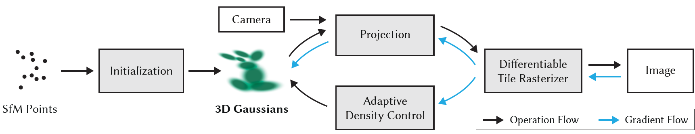

1. 录一段视频或者拍一组不同角度的照片，用 SfM 估计点云。
2. 点云中的每一个点代表着一个 3D 高斯，初始化均值，协方差，不透明度，颜色（用球谐系数表征）等参数。细节见[每个点的表征](#每个点的表征)。
3. 进行快速渲染算法，渲染出一张图像。细节见[快速渲染算法](#快速渲染算法)。
4. 和 ground truth 做损失，对每个点的位置、不透明度、协方差、球谐系数做优化，同时会添加或者删除一些点。细节见[优化算法](#优化算法)。

## 细节

### 每个点的表征

1. 3D 高斯的均值和协方差，具体推导见下：[3D 高斯](#3D 高斯) 以及 [局部线性近似的透视投影](#局部线性近似的透视投影)
   $$
   \mathcal{G}_{\mu,\Sigma}(x)\thicksim\exp(-\frac{1}{2}(x-\mu)^T\Sigma^{-1}(x-\mu))
   $$
   可以将 3D 高斯想象成一个个椭球，这里协方差矩阵 $\Sigma$ 控制了椭球的形状和朝向。

   这个 3D 高斯经过 View-Projection 变换后还是 3D 高斯。这个 3D 高斯沿着深度积分后是一个 2D 高斯。

2. 球谐函数，具体推导见下：[球谐函数](#球谐函数)

   球谐函数使得每个点的颜色为各向异性。根据一个点和相机位置的对应关系很容易得到该点在相机视角下的颜色。

### 快速渲染算法

最基本的渲染公式见下：[基于点的渲染](#基于点的渲染)

这种算法的目标（优点）：

1. 快速。
2. 可微，并且能够梯度下降的点的数量不受限制。

正向渲染流程：

1. 将屏幕空间分为一个个 $16\times 16$ 的块（tiles）。
2. 挑选出每个 tile 的视锥包裹的 3D 高斯，并且舍去相机近平面附近的点以及太远的点。
3. 实例化每个高斯点，为每个实例分配 tile ID 以及 View Space Depth 作为 Key。
4. 使用 fast GPU Radix sort 对实例进行排序。
5. 根据排序结果和 tile ID，为每个 tile 生成一个列表，里面是每个 tile 从近到远需要 splat 的 3D 高斯。
6. 为每个 tile 开启一个线程块，首先每个线程块将需要 splat 的高斯点加载到共享内存中，然后对每个像素，顺序遍历列表并将高斯点一一抛射上去，同时累积不透明度。一旦不透明度达到 1，就停止对应像素的线程。当一个 tile 中所有像素的线程都停止了，那么停止对应 tile 的线程块。

反向传播流程：

1. 之前的方法是开一个动态大小的内存，每抛一个点往里面加一个点。这篇论文的做法是复用之前的列表：正向渲染时当不透明度饱和时记录最深点的 index，然后对每个 tile 从后往前遍历参与渲染的点。
2. 再次将这些点加载到共享内存。对于每个像素，反向传播那些对该像素的 alpha blending 有贡献的点。

### 优化算法

1. 损失函数
   $$
   \mathcal{L}=(1-\lambda)\mathcal{L}_1+\lambda \mathcal{L}_{D-SSIM}\quad \lambda=0.2
   $$

2. 对参数的梯度下降

   对于不透明度以及颜色的反向传播是比较简单的。对于旋转缩放的反向传播见下：[梯度的反向传播](#梯度的反向传播)。

3. 自适应密度控制

   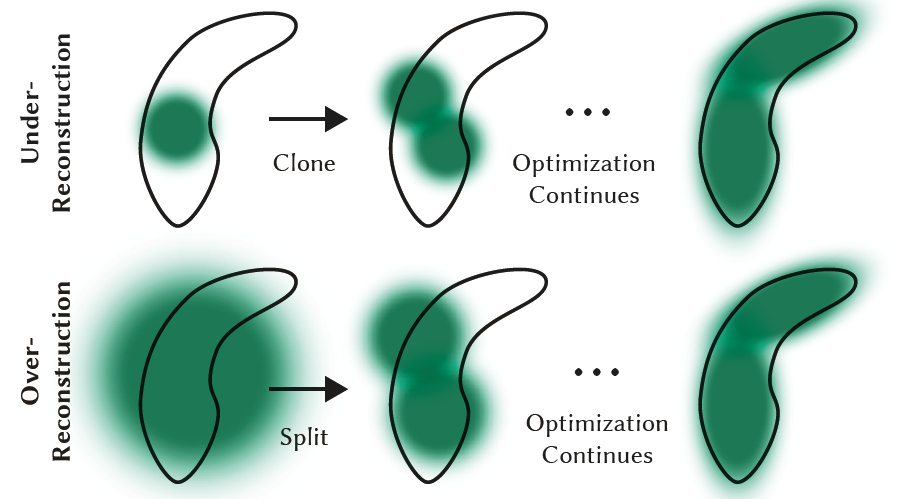

   - 每一百次迭代移除不透明度小于阈值的点。
   - 重建不充分的点往往有比较大的梯度，梯度大于阈值就要做 densify，这时候看这个点的协方差矩阵的特征值：
     - 如果特征值很大，说明 3D 高斯的粒度太大，需要 split。具体做法是首先确定是 scale 大小为原来的 $1/1.6$，然后用原来的 3D 高斯作为 PDF 来确定两个点的初始位置。
     - 如果特征值很小，说明 3D 高斯的粒度太小，需要 clone。具体做法是 position 梯度方向 clone 一个一模一样的点。
   - 每 3000 次迭代将不透明度重置为接近 0，这样可以有效抑制点数量的增长以及相机附近存在 floater 的现象。
   - 周期性地移除比较大的高斯点以避免重叠和点数量的快速增长。

## 实验

### 渲染效果对比

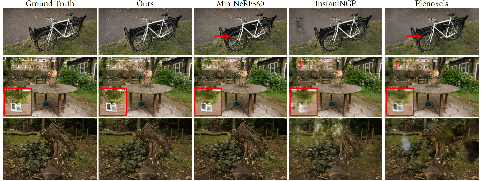

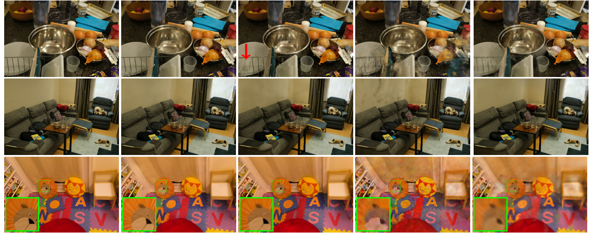

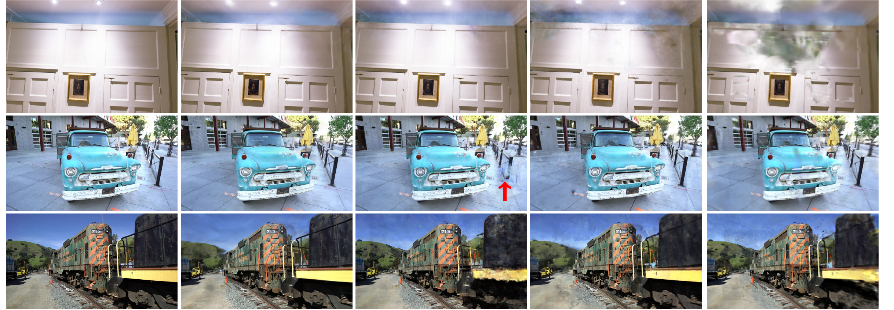

可以看出，这个方法主要的有点在于：

1. floaters 基本没有。
2. 一些比较细长的物体，例如自行车的辐条、树干的纹理等表现的比较好。
3. 对一些 glossy 的反射，例如第四个数据集中的铁碗，表现比较好（应该是采用了球谐函数的原因，Plenoxels 这些表现也比较好）

### 训练时间、渲染时间对比

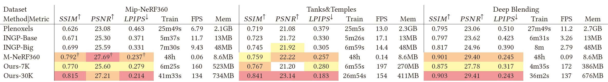

可以看到训练时间和 Instant-NGP 差不多，属于最快的那一个梯队。（里面多少 K 指训练了多少 K Iteration）

同时渲染的 FPS 是最高的，完全达到了实时渲染的要求。

### 消融实验

他们分别进行了点云随机初始化、取消 Split 点、取消 Clone 点、限制反向传播点的数目、高斯形状各向同性、颜色表达各项同性等消融实验，结果如图：

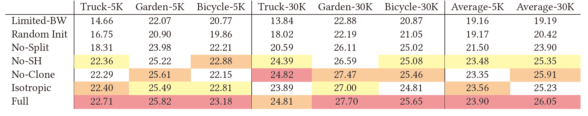

1. 点云随机初始化与 SfM 输入点云对比：

   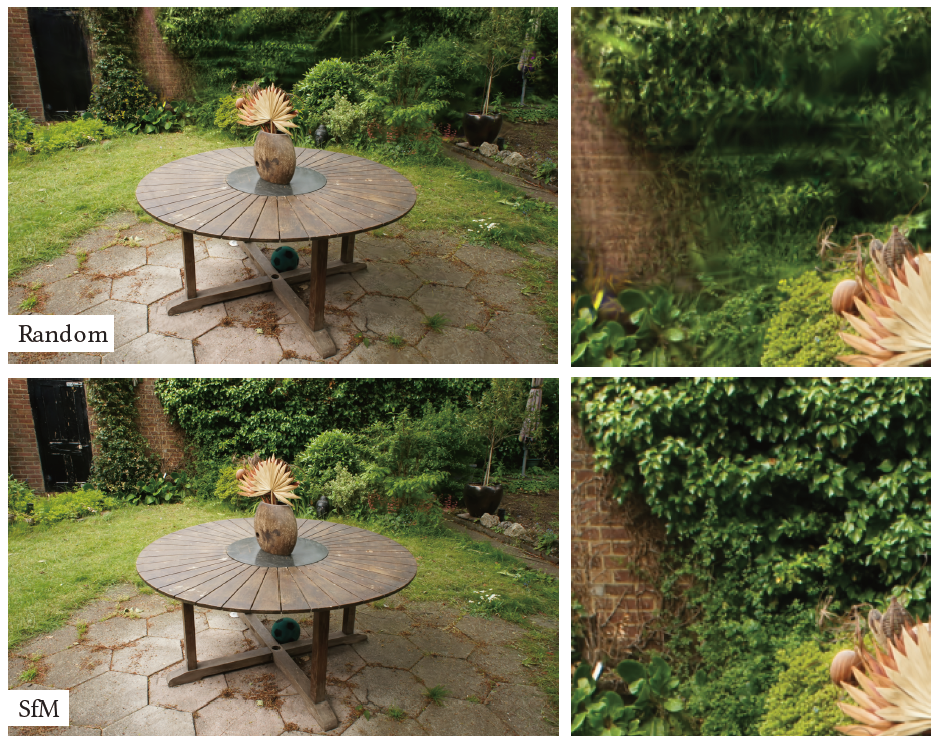

2. densify 两种方法消融实验的对比：

   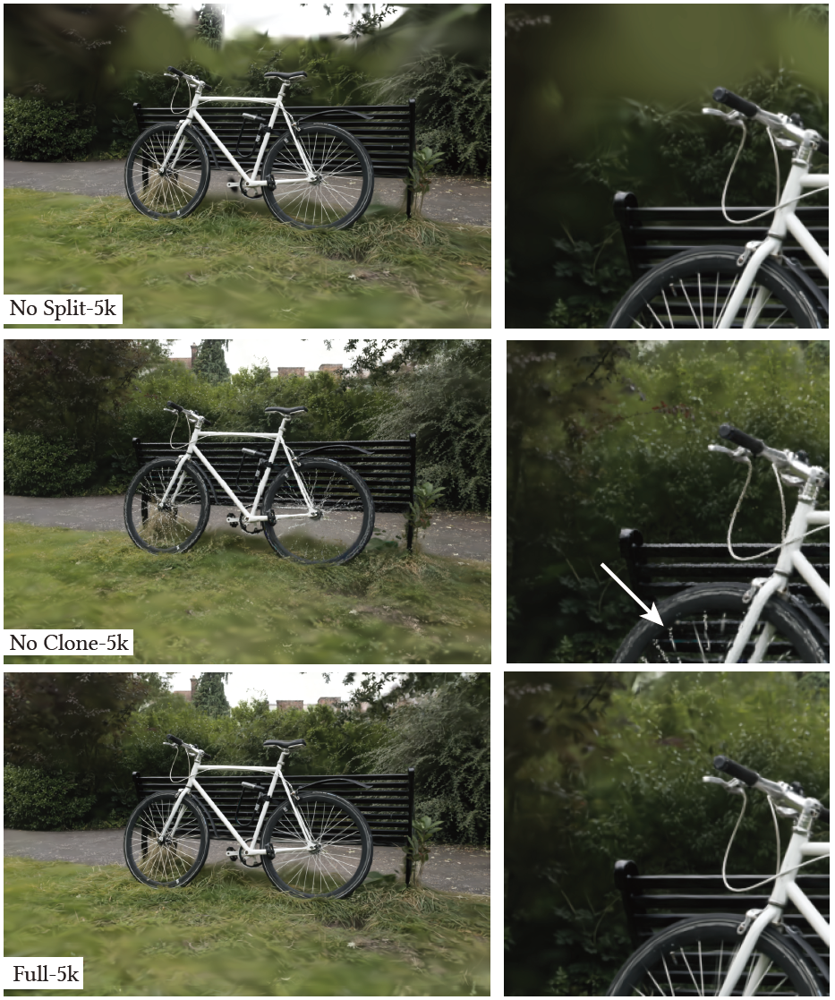

3. 梯度下降点数目限制与没有限制效果对比

   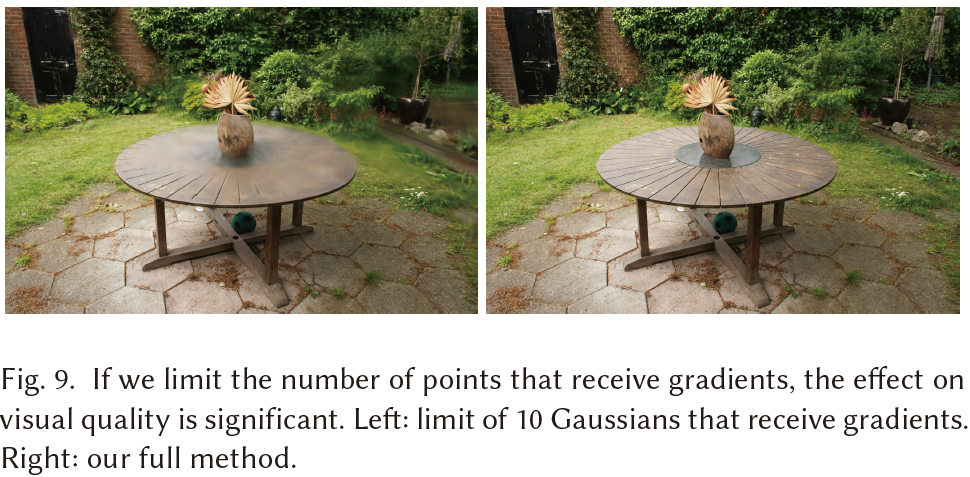

4. 高斯协方差矩阵各向同性和各向异性效果对比：

   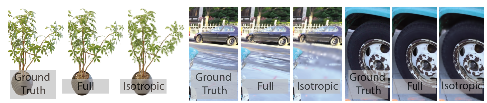

## 讨论

### 为什么选择 3D 高斯

对于重建核的选择，肯定是要选那些随着距离增大逐渐下降的函数。并且根据下降的幅度是否随距离的方向变化而变化可以将重建核分为各项同性和各向异性。

显然，一个各项异性的函数来建模空间中的几何比用一个各项同性的球 fit 更好，毕竟各项异性的函数可以退化为各项同性的函数，并且对于细长的物体各项异性的重建核能更好的拟合。他们在上述实验中也证明了这一点。

在各项异性的函数中，3D 高斯的表达方式非常 elegant，根据下面的推导，3D 高斯在经过 View-Projection 视图变换、然后对深度积分后的结果还是一个高斯函数，并且这个 2D 高斯的协方差矩阵对原本的 3D 高斯的协方差矩阵的梯度也能够较快的算出来。除此之外 3D 高斯还有傅里叶变换后依然是高斯、与高斯卷积后依然是高斯等一系列优良性质。

最后，3D 高斯能用于他们提出的基于排序的快速渲染算法，所以最终就选择了 3D 高斯。

### 为什么使用球面谐波函数

在 PBR 渲染中，一个点的颜色除了与物体本身的材质相关外，还与光线的入射方向和出射方向相关：
$$
L_0(p,\omega_0)=\int_\Omega f_r(p,\omega_i,\omega_0)L_i(p,\omega_i)(n\cdot\omega_i)d\omega_i
$$
而目前三维重建的体渲染理论没有考虑光线的外散射和内散射，只考虑了发光和遮挡，这导致了从任意视角看一个点，这个点的颜色是不变的。

想让一个点的颜色在各个方向上是不同的，我们可以通过打表形式来离散地建模一个点在不同方向的发射光线。但是一个场景有几百万个点，每个点就算只使用 $8\times 8$ 个 float 来表征需要几百个 GB，这肯定是不行的。

另一种方式是用球面函数来拟合，那么就自然而然想到球谐函数。一个点只需要 10 个（四阶球谐）系数就能表征，并且计算方便，梯度下降也能够综合优化所有的系数，是一个非常好的选择。

### 还有哪些可以改进的地方

1. 首先因为论文使用的是球谐函数，并且为了显存和渲染速度的考虑不能使用高阶球谐，因此它基本上只能重建 diffuse 或者是部分 glossy 的物体，而对于镜面、玻璃这种基本上是很难重建的。这个其实看 [渲染效果对比](#渲染效果对比) 倒数第二个数据集对于汽车玻璃的重建就能看出来。

2. 论文中提到，对于没有充分拍摄到的物体（比如就一张或者几张图像覆盖的区域），重建会出现污点，并且这一点应该也是目前 NeRF 的通病。

   

3. 对 GPU 的显存消耗巨大，对于一个大场景他们会消耗超过 20G 的显存。

4. 另外他们的排序算法可能也有些问题，他们对点的排序是按照均值来排的，而对于某些像素均值比较远的点不一定会排在比较近的高斯点后面，比如：

   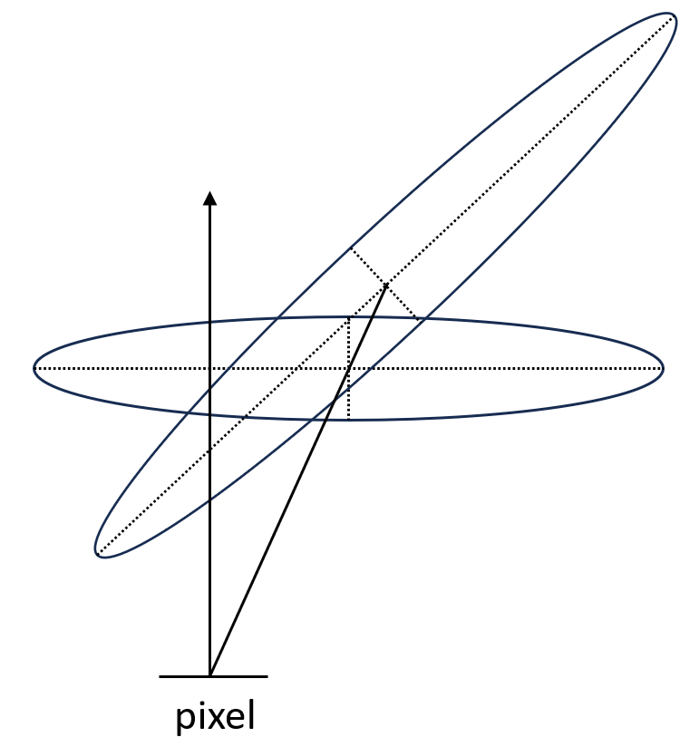

   

## 公式推导

### 基于点的渲染

体渲染公式为：
$$
\begin{align}
& I(s)=\sum_{n=1}^NT_nC_n(1-e^{-\sigma_n\delta_n})+T(s)I_0\\
& where\ T_n= e^{\sum_{k=1}^{n}-\sigma_k\delta_k}
\end{align}
$$
基于点的 $\alpha$ 混合渲染和 NeRF 的体渲染公式基本是一致的：
$$
\begin{align}
& C=\sum_{i=1}^NT_i(1-\exp(-\sigma_i\delta_i))c_i\ with\ T_i=\exp(-\sum_{j=1}^{i-1}\sigma_j\delta_j)\\
& \text{denote that }\alpha_i=1-\exp(-\sigma_i\delta_i)\\
& \therefore C=\sum_{i\in\mathcal{N}}c_i\alpha_i\prod_{j=1}^{i-1}(1-\alpha_j)\\
\end{align}
$$

不过基于点的渲染和 NeRF 不同的是：NeRF 是从相机发出光线，然后在光线上采样。而基于点的渲染更多是从近到远将点投影到相机平面上，并且 $\alpha_i$ 用不透明度和重建核的乘积来度量。

### 抛雪球算法（Splatting）

抛雪球算法是一种用于体积渲染的技术，其使用 reconstruction kernels 来确定体素如何影响其周围空间。大致算法流程为：

1. 每个体素包含有关该点的信息，如颜色、不透明度和重建核等。
2. 视图投影：仿射变换从世界坐标系转到相机坐标系。
3. 透视投影：将每个体素映射到屏幕空间。
4. 对每个 reconstruction kernel 沿着深度积分，生成一个 footprint。footprint 描述了体素对周围像素的影响。
5. 计算每个体素的重构核足迹与其他体素足迹的重叠部分。这涉及对足迹中的像素值进行积分，以确定最终像素的颜色和不透明度。
6. 将所有体素的影响合并起来，创建最终的渲染图像。这包括颜色和不透明度的混合。

### 3D 高斯

- 一维高斯分布的 PDF：
  $$
  \begin{flalign}
  & x\thicksim \mathcal{N}(\mu,\sigma^2)\\
  & p(x)=\frac{1}{\sigma\sqrt{2\pi}}\exp(-\frac{(x-\mu)^2}{2\sigma^2})
  \end{flalign}
  $$

- 对于三维向量 $v=[a,b,c]^T\ a,b,c\thicksim\mathcal{N}(0,1)$，那么：
  $$
  \begin{flalign}
  & p(v)=p(a)p(b)p(c)=\\
  & \frac{1}{(2\pi)^{3/2}}\exp(-\frac{a^2+b^2+c^2}{2})=\frac{1}{(2\pi)^{3/2}}\exp(-\frac{1}{2}v^Tv)
  \end{flalign}
  $$

- 对于任意的可能互相不独立的、均值不一定为 0、方差不一定为 1 的三维向量 $x=[x,y,z]^T$，我们通过一个线性变换将其变换到 $v$：
  $$
  \begin{flalign}
  & v=A(x-\mu)\\
  & p(v)=\frac{1}{(2\pi)^{3/2}}\exp(-\frac{1}{2}v^Tv)=\frac{1}{(2\pi)^{3/2}}\exp(-\frac{1}{2}(x-\mu)^TA^TA(x-\mu))\\
  & 1=\int\int\int_{-\infty}^{+\infty}\frac{1}{(2\pi)^{3/2}}\exp(-\frac{1}{2}(x-\mu)^TA^TA(x-\mu))dv\\
  & \because dv = d(A(x-\mu))=dAx=|A|dx\\
  & \therefore 1=\int\int\int_{-\infty}^{+\infty}\frac{|A|}{(2\pi)^{3/2}}\exp(-\frac{1}{2}(x-\mu)^TA^TA(x-\mu))dx\\
  & \therefore p(x)=\frac{|A|}{(2\pi)^{3/2}}\exp(-\frac{1}{2}(x-\mu)^TA^TA(x-\mu))\\
  \end{flalign}
  $$

- 计算投影矩阵 $A$，记 $x$ 的协方差矩阵为 $\Sigma$，因为协方差矩阵是半正定的，因此有：
  $$
  \begin{align}
  & \Sigma x=\lambda x\\
  & \Sigma U=U\Lambda\\
  & \because\text{实对称矩阵的特征向量是正交的}\\
  & \therefore U^{-1}=U^T\\
  & \therefore \Sigma=U\Lambda U^T=U\Lambda^{1/2}(U\Lambda^{1/2})^T
  \end{align}
  $$
  其中 $U$ 是特征向量矩阵，列相互正交并且 $UU^T=I$，$\Lambda$ 是特征根矩阵。令：

$$
  A=\Lambda^{-1/2}U^T=(U\Lambda^{-1/2})^T
$$
  那么 $A$ 的行向量之间相互正交，并且：
$$
\begin{align}
  & \Sigma^{-1}=U\Lambda^{-1/2}(U\Lambda^{-1/2})^T=A^TA\\
  & |\Sigma^{-1}|=\frac{1}{|\Sigma|}=|A^T||A|=|A|^2\\
  & \therefore p(x)=\frac{1}{|\Sigma|^{1/2}(2\pi)^{3/2}}\exp(-\frac{1}{2}(x-\mu)^T\Sigma^{-1}(x-\mu))\\
  \end{align}
$$

- **为什么形状是一个椭球**：
  $$
  \begin{flalign}
  & \Delta=(x-\mu)^T\Sigma^{-1}(x-\mu)\\
  & =(x-\mu)^T(U\Lambda U^T)^{-1}(x-\mu)\\
  & =(x-\mu)^TU\Lambda^{-1} U^T(x-\mu)\\
  & =(x-\mu)^T(
  \left[
  \begin{array}{cc}
  u_1\frac{1}{\lambda_1} & u_2\frac{1}{\lambda_2} & \cdots & u_n\frac{1}{\lambda_n}
  \end{array}
  \right]
  \left[
  \begin{array}{cc}
  u_1^T\\
  u_2^T\\
  \vdots\\
  u_n^T
  \end{array}
  \right]
  )(x-\mu)\\
  & =(x-\mu)^T\sum u_i\frac{1}{\lambda_i}u_i^T(x-\mu)\\
  & =\sum (x-\mu)^Tu_i\frac{1}{\lambda_i}u_i^T(x-\mu)\\
  & =\sum y_i\frac{1}{\lambda_i} y_i^T\\
  \end{flalign}
  $$
  
  因为 $\Sigma$ 是半正定的，并且一般都是正定的，所以特征值$\lambda_i$都是正数。
  
  因此结果出来是椭球的表达式。并且协方差矩阵的特征向量是椭球轴的方向，特征值衡量了椭球在这个方向上的拉伸。
  
- 如何初始化这个协方差矩阵 $\Sigma$：

  **因为 $\Sigma$ 是一个半正定的实对称矩阵，因此不能直接随机初始化一个 $3\times 3$ 矩阵**，考虑到椭球的特性，其实 $A(x-\mu)$ 想把坐标系从椭球的局部坐标系转到世界坐标系，因此 $A$ 可以变成先做一个旋转，然后再做一个拉伸：
  $$
  \begin{align}
  & A=S'R'\\
  & \Sigma=(A^TA)^{-1}=R'^{-1}S'^{-1}(S'^{-1})^T(R'^{-1})^T\\
  \end{align}
  $$
  因为缩放矩阵的逆也是缩放矩阵，渲染矩阵的逆也是旋转矩阵，因此 $\Sigma$ 可以写为：
  $$
  \Sigma=RSS^TR^T
  $$
  其中缩放矩阵可以用一个三维数组表示，旋转矩阵可以用一个四元数表示：
  $$
  (\cos(\frac{\theta}{2})+\sin(\frac{\theta}{2})(ai+bj+ck))\times\\(xi+yj+zk)\times\\(\cos(\frac{\theta}{2})-\sin(\frac{\theta}{2})(ai+bj+ck))
  $$
  不妨令：
  $$
  q=\cos(\frac{\theta}{2})+\sin(\frac{\theta}{2})(ai+bj+ck)=w+xi+yj+zk
  $$
  那么旋转矩阵可以表示为：
  $$
  R = \begin{bmatrix}
  1 - 2y^2 - 2z^2 & 2xy - 2zw & 2xz + 2yw \\
  2xy + 2zw & 1 - 2x^2 - 2z^2 & 2yz - 2xw \\
  2xz - 2yw & 2yz + 2xw & 1 - 2x^2 - 2y^2
  \end{bmatrix}
  $$

- **高斯分布的性质**

  根据上述，多元高斯函数可以写为：
  $$
  \mathcal{G}^{(n)}_{\mu,\Sigma}(x)=\frac{1}{|\Sigma|^{1/2}(2\pi)^{n/2}}\exp(-\frac{1}{2}(x-\mu)^T\Sigma^{-1}(x-\mu))
  $$

  - **高斯函数和高斯函数的卷积还是高斯函数**

    计算高斯函数的傅里叶变换：
    $$
    \begin{align}
    & \mathcal{F}[\mathcal{G}^{(n)}_{\mu,\Sigma}(x)]=\frac{1}{|\Sigma|^{1/2}(2\pi)^{n/2}}\int_{-\infty}^{+\infty}\mathrm{e}^{-\frac{1}{2}(x-\mu)^T\Sigma^{-1}(x-\mu)}\mathrm{e}^{-jx^Tw}dx\\
    & =\frac{1}{|\Sigma|^{1/2}(2\pi)^{n/2}}\int_{-\infty}^{+\infty}\mathrm{e}^{-\frac{1}{2}(x-\mu)^TA^TA(x-\mu)}\mathrm{e}^{-jx^Tw}dx\\
    & \text{denote } y=A(x-\mu)\text{ then}\\
    & \mathcal{F}[\mathcal{G}^{(n)}_{\mu,\Sigma}(x)]=\frac{1}{|\Sigma|^{1/2}(2\pi)^{n/2}}\int_{-\infty}^{+\infty}\mathrm{e}^{-\frac{1}{2}y^Ty}\mathrm{e}^{-j(A^{-1}y+\mu)^Tw}dx\\
    & =\frac{1}{|\Sigma|^{1/2}(2\pi)^{n/2}}\int_{-\infty}^{+\infty}\mathrm{e}^{-\frac{1}{2}y^Ty}\mathrm{e}^{-j(A^{-1}y+\mu)^Tw}dx\\
    & =\frac{1}{|\Sigma|^{1/2}(2\pi)^{n/2}}\mathrm{e}^{-j\mu^Tw}\int_{-\infty}^{+\infty}\mathrm{e}^{-\frac{1}{2}y^Ty-jy^T{A^{-1}}^Tw}dx\\
    \end{align}
    $$
    注意到：
    $$
    \begin{align}
    & -\frac{1}{2}(y+j{A^{-1}}^Tw)^T(y+j{A^{-1}}^Tw)\\
    & =-\frac{1}{2}(y^Ty+jy^T{A^{-1}}^Tw+jw^TA^{-1}y-w^TA^{-1}{A^{-1}}^Tw)\\
    & =-\frac{1}{2}y^Ty-jy^T{A^{-1}}^Tw+\frac{1}{2}w^TA^{-1}{A^{-1}}^Tw\\
    \end{align}
    $$
    因此傅里叶变换可以更改为：
    $$
    \begin{align}
    & \mathcal{F}[\mathcal{G}^{(n)}_{\mu,\Sigma}(x)]=\\
    & \frac{1}{|\Sigma|^{1/2}(2\pi)^{n/2}}\mathrm{e}^{-j\mu^Tw}\mathrm{e}^{-\frac{1}{2}w^TA^{-1}{A^{-1}}^Tw}\int_{-\infty}^{+\infty}\mathrm{e}^{-\frac{1}{2}(y+j{A^{-1}}^Tw)^T(y+j{A^{-1}}^Tw)}\mathrm{d}x\\
    & \because \mathrm{d}y=\mathrm{d}A(x-\mu)=|A|\mathrm{d}x\\
    & \therefore \mathrm{d}x=\frac{1}{|A|}\mathrm{d}y=|\Sigma|^{1/2}\mathrm{d}y\\
    & \therefore \mathcal{F}[\mathcal{G}^{(n)}_{\mu,\Sigma}(x)]=\\
    & \frac{1}{(2\pi)^{n/2}}\mathrm{e}^{-j\mu^Tw}\mathrm{e}^{-\frac{1}{2}w^TA^{-1}{A^{-1}}^Tw}\int_{-\infty}^{+\infty}\mathrm{e}^{-\frac{1}{2}(y+j{A^{-1}}^Tw)^T(y+j{A^{-1}}^Tw)}\mathrm{d}y\\
    & \text{denote } z=y+j{A^{-1}}^Tw\text{ then}\\
    & \mathcal{F}[\mathcal{G}^{(n)}_{\mu,\Sigma}(x)]=\frac{1}{(2\pi)^{n/2}}\mathrm{e}^{-j\mu^Tw}\mathrm{e}^{-\frac{1}{2}w^TA^{-1}{A^{-1}}^Tw}\int_{-\infty}^{+\infty}\mathrm{e}^{-\frac{1}{2}z^Tz}\mathrm{d}z\\
    \end{align}
    $$
    对于积分 $\int_{-\infty}^{+\infty}\mathrm{e}^{-\frac{1}{2}z^Tz}\mathrm{d}z$：
    $$
    \begin{align}
    & \text{denote }\int_{-\infty}^{+\infty}\mathrm{e}^{-x^2}\mathrm{d}x=I\\
    & I^2=\int_{-\infty}^{+\infty}\mathrm{e}^{-x^2}\mathrm{d}x\int_{-\infty}^{+\infty}\mathrm{e}^{-x^2}\mathrm{d}x\\
    & =\int_{-\infty}^{+\infty}\mathrm{e}^{-x^2}\mathrm{d}x\int_{-\infty}^{+\infty}\mathrm{e}^{-y^2}\mathrm{d}y\\
    & =\int_{-\infty}^{+\infty}\int_{-\infty}^{+\infty}\mathrm{e}^{-(x^2+y^2)}\mathrm{d}x\mathrm{d}y\\
    & =\int_{0}^{2\pi}\mathrm{d}\theta\int_{0}^{+\infty}\mathrm{e}^{-r^2}r\mathrm{d}r\\
    & =\pi\\
    & \therefore \int_{-\infty}^{+\infty}\mathrm{e}^{-x^2}\mathrm{d}x=\sqrt{\pi}\\
    & \therefore \int_{-\infty}^{+\infty}\mathrm{e}^{\frac{-x^2}{2}}\mathrm{d}x=\sqrt{2\pi}\\
    & \therefore \int_{-\infty}^{+\infty}\mathrm{e}^{-\frac{1}{2}(\sum_{i=1}^n x_i^2)}\mathrm{d}x_1\mathrm{d}x_2\cdots \mathrm{d}x_n=(\sqrt{2\pi})^n\\
    \end{align}
    $$
    因此我们有：
    $$
    \begin{align}
    & \mathcal{F}[\mathcal{G}^{(n)}_{\mu,\Sigma}(x)]=\frac{1}{(2\pi)^{n/2}}\mathrm{e}^{-j\mu^Tw}\mathrm{e}^{-\frac{1}{2}w^TA^{-1}{A^{-1}}^Tw}\int_{-\infty}^{+\infty}\mathrm{e}^{-\frac{1}{2}z^Tz}\mathrm{d}z\\
    & =\frac{1}{(2\pi)^{n/2}}\mathrm{e}^{-j\mu^Tw}\mathrm{e}^{-\frac{1}{2}w^TA^{-1}{A^{-1}}^Tw}\sqrt{2\pi}^n\\
    & =\mathrm{e}^{-j\mu^Tw}\mathrm{e}^{-\frac{1}{2}w^TA^{-1}{A^{-1}}^Tw}\\
    & =\mathrm{e}^{-\frac{1}{2}w^T\Sigma w-j\mu^Tw}\\
    \end{align}
    $$
    所以高斯函数的傅里叶变换仍然是一个高斯函数，并且协方差矩阵从 $\Sigma^{-1}$ 变成了 $\Sigma$，均值在虚轴上。

    因为时域上的卷积对应于频域上的乘积，所以：
    $$
    \begin{align}
    & \mathcal{G}^{(n)}_{\mu_1,\Sigma_1}(x)\ast \mathcal{G}^{(n)}_{\mu_2,\Sigma_2}(x)\\
    & =\mathcal{F}^{-1}[\mathrm{e}^{-\frac{1}{2}w^T\Sigma_1 w-j\mu_1^Tw}\cdot \mathrm{e}^{-\frac{1}{2}w^T\Sigma_2 w-j\mu_2^Tw}]\\
    & =\mathcal{G}^{(n)}_{\mu_1+\mu_2,\Sigma_1+\Sigma_2}(x)
    \end{align}
    $$

  - **高斯函数的仿射变换还是高斯函数**
    $$
    \begin{align}
    & \text{denote }\phi(x)=Mx+b\text{ then}\\
    & \mathcal{G}_{\mu,\Sigma}^{(n)}(x)=\frac{1}{|\Sigma|^{1/2}(2\pi)^{n/2}}\mathrm{e}^{-\frac{1}{2}(x-\mu)^T\Sigma^{-1}(x-\mu)}\\
    & =\frac{1}{|\Sigma|^{1/2}(2\pi)^{n/2}}\mathrm{e}^{-\frac{1}{2}(M^{-1}(\phi(x)-b)-\mu)^T\Sigma^{-1}(M^{-1}(\phi(x)-b)-\mu)}\\
    & =\frac{1}{|\Sigma|^{1/2}(2\pi)^{n/2}}\mathrm{e}^{-\frac{1}{2}[M^{-1}(\phi(x)-b-M\mu)]^T\Sigma^{-1}[M^{-1}(\phi(x)-b-M\mu)]}\\
    & =\frac{|M|}{|M|^{1/2}|\Sigma|^{1/2}|M|^{1/2}(2\pi)^{n/2}}\mathrm{e}^{-\frac{1}{2}(\phi(x)-b-M\mu)^T{M^{-1}}^T\Sigma^{-1}M^{-1}(\phi(x)-b-M\mu)}\\
    & =|M|\mathcal{G}_{\phi(\mu),M\Sigma M^T}^{(n)}(\phi(x))
    \end{align}
    $$

  - **多元高斯分布的边缘分布还是高斯分布**

    首先规定：
    $$
    \begin{align}
    & \text{for n-dimention vector } x^{(n)}=
    \left[
    \begin{array}{cc}
    x_1\\x_2\\\vdots \\x_n
    \end{array}
    \right]
    \text{, denote } x^{(n)}=
    \left[
    \begin{array}{cc}
    x^{(n-1)}\\x_n
    \end{array}
    \right]\\
    
    & \text{for the expectation } \mu^{(n)}=
    \left[
    \begin{array}{cc}
    \mu_1\\\mu_2\\\vdots \\\mu_n
    \end{array}
    \right]
    \text{, denote } \mu^{(n)}=
    \left[
    \begin{array}{cc}
    \mu^{(n-1)}\\\mu_n
    \end{array}
    \right]\\
    
    & \text{for the covariance matrix } \Sigma^{(n)}=
    \left[
    \begin{array}{cc}
    \sigma_{11} & \sigma_{12} & \cdots & \sigma_{1n}\\
    \sigma_{21} & \sigma_{22} & \cdots & \sigma_{2n}\\
    \vdots & \vdots & \ddots & \vdots\\
    \sigma_{n1} & \sigma_{n2} & \cdots & \sigma_{nn}
    \end{array}
    \right]\\
    & \text{, denote } \Sigma^{(n)}=
    \left[
    \begin{array}{cc}
    \Sigma_{11} & \Sigma_{12}\\
    \Sigma_{21} & \Sigma_{22}
    \end{array}
    \right]
    \text{ where $\Sigma_{11}$ is a $(n-1)\times(n-1)$ matrix}\\
    
    & \text{for positive definite symmetric matrix $\Sigma$, }\Sigma^{-1}=
    \left[
    \begin{array}{cc}
    A & B\\
    C & D
    \end{array}
    \right]
    \text{ where}\\
    & A = (\Sigma_{11} - \Sigma_{12} \Sigma_{22}^{-1} \Sigma_{21})^{-1}\\
    & B = -(\Sigma_{11} - \Sigma_{12} \Sigma_{22}^{-1} \Sigma_{21})^{-1} \Sigma_{12} \Sigma_{22}^{-1}\\
    & C = -\Sigma_{22}^{-1} \Sigma_{21} (\Sigma_{11} - \Sigma_{12} \Sigma_{22}^{-1} \Sigma_{21})^{-1}\\
    & D = \Sigma_{22}^{-1} + \Sigma_{22}^{-1} \Sigma_{21} (\Sigma_{11} - \Sigma_{12} \Sigma_{22}^{-1} \Sigma_{21})^{-1} \Sigma_{12} \Sigma_{22}^{-1}\\
    \end{align}
    $$
    于是积分可以表示为：
    $$
    \begin{align}
    & \int \mathcal{G}_{\mu,\Sigma}^{(n)}(x^{(n)})\mathrm{d}x_n\\
    & =\int \frac{1}{|\Sigma|^{1/2}(2\pi)^{n/2}}\mathrm{e}^{-\frac{1}{2}(x^{(n)}-\mu)^T\Sigma^{-1}(x^{(n)}-\mu)}\mathrm{d}x_n\\
    
    & =\int \frac{1}{|\Sigma|^{1/2}(2\pi)^{n/2}}\\
    & \exp{(-\frac{1}{2}
    \left[
    \begin{array}{cc}
    x^{(n-1)}-\mu^{(n-1)}\\x_n-\mu_n
    \end{array}
    \right]^T
    \left[
    \begin{array}{cc}
    \Sigma_{11} & \Sigma_{12}\\
    \Sigma_{21} & \Sigma_{22}
    \end{array}
    \right]^{-1}
    \left[
    \begin{array}{cc}
    x^{(n-1)}-\mu^{(n-1)}\\x_n-\mu_n
    \end{array}
    \right]
    )}\mathrm{d}x_n\\
    
    & =\frac{1}{|\Sigma|^{1/2}(2\pi)^{n/2}}\\
    & \int \exp{(-\frac{1}{2}
    \left[
    \begin{array}{cc}
    x^{(n-1)}-\mu^{(n-1)}\\x_n-\mu_n
    \end{array}
    \right]^T
    \left[
    \begin{array}{cc}
    A & B\\
    C & D
    \end{array}
    \right]
    \left[
    \begin{array}{cc}
    x^{(n-1)}-\mu^{(n-1)}\\x_n-\mu_n
    \end{array}
    \right]
    )}\mathrm{d}x_n\\
    
    & \thicksim\int \exp{(-\frac{1}{2}
    \left(
    \begin{array}{cc}
    (x^{(n-1)}-\mu^{(n-1)})^T A (x^{(n-1)}-\mu^{(n-1)}) +\\
    (x_n-\mu_n)^T C (x^{(n-1)}-\mu^{(n-1)}) +\\
    (x^{(n-1)}-\mu^{(n-1)})^T B (x_n-\mu_n) +\\
    (x_n-\mu_n)^T D (x_n-\mu_n)
    \end{array}
    \right)
    )}\mathrm{d}x_n\\
    
    & \text{note }-\frac{1}{2}(x-\mu)^T\Sigma^{-1}(x-\mu)=-\frac{1}{2}x^T\Sigma^{-1}x+x^T\Sigma^{-1}\mu+Const\\
    
    & \text{therefore the quadratic term of }x_n \text{ is } -\frac{1}{2}x_n^TDx_n\\
    & \text{the primary term of }x_n \text{ is } x_n^Tm\text{ where}\\
    & m=D\mu_n-\frac{1}{2}C(x^{(n-1)}-\mu^{(n-1)})-\frac{1}{2}(x^{(n-1)}-\mu^{(n-1)})^TB\\
    & \because B=C^T\\
    & \therefore m=D\mu_n-C(x^{(n-1)}-\mu^{(n-1)})\\
    & \text{extract other terms:}\\
    & \thicksim \int \exp(-\frac{1}{2}x_n^TDx_n+x_n^Tm)\mathrm{d}x_n\\
    & \thicksim \int \exp(-\frac{1}{2}(x_n-D^{-1}m)^TD(x_n-D^{-1}m)+\frac{1}{2}m^TD^{-1}m)\mathrm{d}x_n\\
    & \thicksim \int \exp(-\frac{1}{2}(x_n-D^{-1}m)^TD(x_n-D^{-1}m))\mathrm{d}x_n\\
    
    & \text{the exponential term extracted from the integrator is:}\\
    & \frac{1}{2}[D\mu_n-C(x^{(n-1)}-\mu^{(n-1)})]^TD^{-1}[D\mu_n-C(x^{(n-1)}-\mu^{(n-1)})]+\\
    & -\frac{1}{2}{x^{(n-1)}}^TAx^{(n-1)}+{x^{(n-1)}}^T(A\mu^{(n-1)}+B\mu_n)+Const\\
    & =-\frac{1}{2}{x^{(n-1)}}^T(A-BD^{-1}C)x^{(n-1)}+{x^{(n-1)}}^T(A-BD^{-1}C)\mu^{(n-1)}\\
    & +Const\\
    
    & \because \Sigma_{11} = (A-BD^{-1}C)^{-1}\\
    & \therefore \Sigma'=\Sigma_{11}
    
    \end{align}
    $$
    
    **多元高斯沿着一个方向积分不仅依旧是一个高斯，并且协方差矩阵是之前协方差矩阵的子矩阵。**

### 局部线性近似的透视投影

考虑相机坐标系的坐标 $t=(t_0,t_1,t_2)^T$，透视投影可以表示为：
$$
\begin{bmatrix}
x_0\\x_1\\x_2
\end{bmatrix}
=\phi(t)=
\begin{bmatrix}
t_0/t_2\\t_1/t_2\\||(t_0,t_1,t_2)||_2
\end{bmatrix}
$$
第三维用 $||(t_0,t_1,t_2)||_2$ 而不是 $t_2$ 的原因是这样做可以保证在不同方向的光线上和相机保持相同距离的物体在经过透视投影后依然在第三维度有相同的距离，这么做能更好的保持高斯重建核对周围像素影响的一致性。

然而，高斯椭球经过这种传统的 Projection 打到相机平面上后不再是一个二维高斯（椭圆），究其原因是因为透视投影不是一个仿射变换，那么高斯重建核的性质就被打破了。

对此，EWA Volume Splatting 提出 Local Affine Approximation（局部线性近似），即对于体素 $k$ 周边的空间，我们使用公式：
$$
\phi_k(t)=\phi_k(t_k)+J_k(t-t_k)
$$
来进行透视投影。这个公式相当于在体素 $k$ 的周围用泰勒展开来近似。其中 $t_k$ 是体素 $k$ 的位置，$J_k$ 是投影矩阵的 Jacobian 矩阵：
$$
J_k=
\begin{bmatrix}
\frac{\partial x_0}{\partial t_0} & \frac{\partial x_0}{\partial t_1} & \frac{\partial x_0}{\partial t_2} \\
\frac{\partial x_1}{\partial t_0} & \frac{\partial x_1}{\partial t_1} & \frac{\partial x_1}{\partial t_2} \\
\frac{\partial x_2}{\partial t_0} & \frac{\partial x_2}{\partial t_1} & \frac{\partial x_2}{\partial t_2} \\
\end{bmatrix}
=
\begin{bmatrix}
\frac{1}{t_{k,2}} & 0 & \frac{-t_{k,0}}{t_{k,2}^2}\\
0 & \frac{1}{t_{k,2}} & \frac{-t_{k,1}}{t_{k,2}^2}\\
\frac{t_{k,0}}{||t_k||} & \frac{t_{k,1}}{||t_k||} & \frac{t_{k,2}}{||t_k||}
\end{bmatrix}
$$
不妨设世界坐标系下某个坐标 $u$，经过 $\Phi$ 转到相机坐标系下 $t$，再经过 Local Affine Approximation 转到屏幕空间 $x$：
$$
\begin{align}
& t=\Phi(u)=Mu+b\\
& x=\phi_k(t)=\phi_k(t_k)+J_K(t-t_k)=\phi_k(t_k)+J_k(Mu+b-t_k)\\
& =J_kMu+\phi_k(t_k)+J_k(b-t_k)\\
& =m_k(u)
\end{align}
$$
之前推导过：
$$
\begin{align}
& \text{for }\phi(x)=Mx+b\text{ we have }\mathcal{G}_{\mu,\Sigma}^{(n)}(x)=|M|\mathcal{G}_{\phi(\mu),M\Sigma M^T}^{(n)}(\phi(x))
\end{align}
$$
因此原本的高斯重建核经过 View-Projection 视图转换有：
$$
\mathcal{G}_{\mu,\Sigma}^{(n)}(x)=|J_kM|\mathcal{G}_{m_k(u),J_kM\Sigma M^TJ_k^T}^{(n)}(m_k(x))
$$
均值从 $u$ 转变到 $J_kMu+\phi_k(t_k)+J_k(b-t_k)$，协方差从原来的 $\Sigma$ 转变到 $J_kM\Sigma M^TJ_k^T$。

然后计算高斯函数的边缘分布以及进行 alpha composition。

### 梯度的反向传播

1. 透视空间中的 $\Sigma'$ 对 $\Sigma$ 的梯度

   根据上述推导，积分后的高斯分布的协方差矩阵是之前协方差矩阵的子矩阵，因此只关注前两阶矩阵的微分：
   $$
   \begin{align}
   & \Sigma'=J_kM\Sigma M^TJ_k^T\\
   & \text{denote }U=J_kM\\
   & \Sigma'=
   \begin{bmatrix}
   U_{11}&U_{12}\\
   U_{21}&U_{22}
   \end{bmatrix}
   \begin{bmatrix}
   \Sigma_{11}&\Sigma_{12}\\
   \Sigma_{21}&\Sigma_{22}
   \end{bmatrix}
   \begin{bmatrix}
   U_{11}&U_{21}\\
   U_{12}&U_{22}
   \end{bmatrix}\\
   & =\begin{bmatrix}
   U_{11}\Sigma_{11}+U_{12}\Sigma_{21} & U_{11}\Sigma_{12}+U_{12}\Sigma_{22}\\
   U_{21}\Sigma_{11}+U_{22}\Sigma_{21} & U_{21}\Sigma_{12}+U_{22}\Sigma_{22}\\
   \end{bmatrix}
   \begin{bmatrix}
   U_{11}&U_{21}\\
   U_{12}&U_{22}
   \end{bmatrix}\\
   & =\begin{bmatrix}
   A&B\\C&D
   \end{bmatrix}\text{ where}\\
   & A=(U_{11}\Sigma_{11}+U_{12}\Sigma_{21})U_{11}+(U_{11}\Sigma_{12}+U_{12}\Sigma_{22})U_{12}\\
   & B=(U_{11}\Sigma_{11}+U_{12}\Sigma_{21})U_{21}+(U_{11}\Sigma_{12}+U_{12}\Sigma_{22})U_{22} \\
   & C=(U_{21}\Sigma_{11}+U_{22}\Sigma_{21})U_{11}+(U_{21}\Sigma_{12}+U_{22}\Sigma_{22})U_{12} \\
   & D=(U_{21}\Sigma_{11}+U_{22}\Sigma_{21})U_{21}+(U_{21}\Sigma_{12}+U_{22}\Sigma_{22})U_{22} \\
   & \therefore \frac{\partial \Sigma'_{xy}}{\partial \Sigma_{ij}}=
   U_{xi}U_{yj}
   \end{align}
   $$
   
2. $\mathcal{L}$ 对 $M=RS$ 的梯度：
   $$
   \begin{align}
   & \text{denote }M=RS\quad \Sigma=RSS^TR=MM^T\\
   & M=\begin{bmatrix}
   a & b \\ c & d
   \end{bmatrix}
   \quad \Sigma=\begin{bmatrix}
   i=a^2+b^2 & j=ac+bd\\
   k=ac+bd & l=c^2+d^2
   \end{bmatrix}\\
   
   & \frac{\partial \mathcal{L}}{\partial a}=\frac{\partial \mathcal{L}}{\partial i}\cdot \frac{\partial i}{\partial a}+\frac{\partial \mathcal{L}}{\partial j}\cdot \frac{\partial j}{\partial a}+\frac{\partial \mathcal{L}}{\partial k}\cdot \frac{\partial k}{\partial a}=2a\frac{\partial \mathcal{L}}{\partial i}+2c\frac{\partial \mathcal{L}}{\partial j}\\
   & \frac{\partial \mathcal{L}}{\partial b}=\cdots=2b\frac{\partial \mathcal{L}}{\partial i}+2d\frac{\partial \mathcal{L}}{\partial j}\\
   & \frac{\partial \mathcal{L}}{\partial b}=\cdots=2a\frac{\partial \mathcal{L}}{\partial k}+2c\frac{\partial \mathcal{L}}{\partial l}\\
   & \frac{\partial \mathcal{L}}{\partial b}=\cdots=2b\frac{\partial \mathcal{L}}{\partial k}+2d\frac{\partial \mathcal{L}}{\partial l}\\
   & \therefore \frac{\partial \mathcal{L}}{\partial M}=
   \begin{bmatrix}
   2a\frac{\partial \mathcal{L}}{\partial i}+2c\frac{\partial \mathcal{L}}{\partial j} & 2a\frac{\partial \mathcal{L}}{\partial k}+2c\frac{\partial \mathcal{L}}{\partial l}\\
   2a\frac{\partial \mathcal{L}}{\partial k}+2c\frac{\partial \mathcal{L}}{\partial l} & 2b\frac{\partial \mathcal{L}}{\partial k}+2d\frac{\partial \mathcal{L}}{\partial l}
   \end{bmatrix}=2
   \begin{bmatrix}
   a&c\\b&d
   \end{bmatrix}
   \begin{bmatrix}
   \frac{\partial \mathcal{L}}{\partial i} & \frac{\partial \mathcal{L}}{\partial j}\\
   \frac{\partial \mathcal{L}}{\partial k} & \frac{\partial \mathcal{L}}{\partial l}
   \end{bmatrix}\\
   & =2M^T\frac{\partial\mathcal{L}}{\partial \Sigma}
   \end{align}
   $$

3. $M$ 对 $R$ 和 $S$ 梯度：
   $$
   \begin{align}
   & R = \begin{bmatrix}
   1 - 2y^2 - 2z^2 & 2xy - 2zw & 2xz + 2yw \\
   2xy + 2zw & 1 - 2x^2 - 2z^2 & 2yz - 2xw \\
   2xz - 2yw & 2yz + 2xw & 1 - 2x^2 - 2y^2
   \end{bmatrix}\\
   & S = \begin{bmatrix}
   s_x&0&0\\
   0&s_y&0\\
   0&0&s_z
   \end{bmatrix}\\
   & RS=\begin{bmatrix}
   s_x(1 - 2y^2 - 2z^2) & s_y(2xy - 2zw) & s_z(2xz + 2yw) \\
   s_x(2xy + 2zw) & s_y(1 - 2x^2 - 2z^2) & s_z(2yz - 2xw) \\
   s_x(2xz - 2yw) & s_y(2yz + 2xw) & s_z(1 - 2x^2 - 2y^2)
   \end{bmatrix}\\
   
   & \frac{\partial M}{\partial x}=
   \begin{bmatrix}
   0 & 2s_yy & 2s_zz\\
   2s_xy & -4s_yx & -2s_zw\\
   2s_xz & 2s_yw & -4s_zx
   \end{bmatrix}\\
   
   & \frac{\partial M}{\partial y}=
   \begin{bmatrix}
   -4s_xy & 2s_yx & 2s_zw\\
   2s_xx & 0 & 2s_zz\\
   -2s_xw & 2s_yz & -4s_zy
   \end{bmatrix}\\
   
   & \frac{\partial M}{\partial z}=
   \begin{bmatrix}
   -4s_xz & -2s_yw & 2s_zx\\
   2s_xw & -4s_yz & 2s_zy\\
   2s_xx & 2s_yy & 0
   \end{bmatrix}\\
   
   & \frac{\partial M}{\partial w}=
   \begin{bmatrix}
   0 & -2s_yz & 2s_zy\\
   2s_xz & 0 & -2s_zx\\
   -2s_xy & 2s_yx & 0
   \end{bmatrix}\\
   
   & \frac{\partial M}{\partial s_x}=
   \begin{bmatrix}
   1 - 2y^2 - 2z^2 & 0 & 0 \\
   2xy + 2zw & 0 & 0 \\
   2xz - 2yw & 0 & 0
   \end{bmatrix}\\
   
   & \frac{\partial M}{\partial s_y}=
   \begin{bmatrix}
   0 & 2xy - 2zw & 0 \\
   0 & 1 - 2x^2 - 2z^2 & 0 \\
   0 & 2yz + 2xw & 0
   \end{bmatrix}\\
   
   & \frac{\partial M}{\partial s_z}=
   \begin{bmatrix}
   0 & 0 & 2xz + 2yw \\
   0 & 0 & 2yz - 2xw \\
   0 & 0 & 1 - 2x^2 - 2y^2
   \end{bmatrix}\\
   
   \end{align}
   $$
   
   

### 球谐函数

球面谐波函数是一系列定义在球面上的二维基函数：

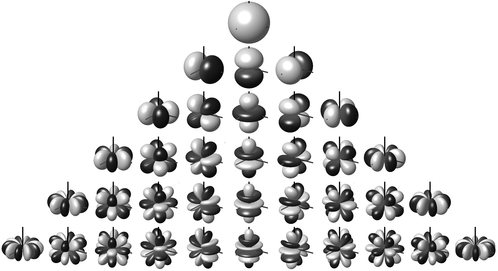

表达式为：
$$
\begin{align}
& y_l^m(\theta,\phi)=
\left \{
\begin{array}{lcl}
\sqrt{2}K_l^m\cos(m\phi)P_l^m(\cos\theta),&m\gt 0\\
\sqrt{2}K_l^m\sin(-m\phi)P_l^{-m}(\cos\theta),&m\lt 0\\
K_l^0P_l^0(\cos\theta),&m=0
\end{array}
\right.\\
& where\\
& P_l^m(x)=(-1)^m(1-x^2)^{m/2}\frac{d^m}{dx^m}(P_l(x))\\
& P_n(x)=\frac{1}{2^n\cdot n!}\frac{d^n}{dx^n}[(x^2-1)^n]\\
& K_l^m=\sqrt{\frac{(2l+1)}{4\pi}\frac{(l-|m|)!}{(l+|m|)!}}
\end{align}
$$
性质：

1. 正交性，一个基函数在另一个基函数上投影是 0，投影到自己结果是 1。

2. 前 $n$ 阶基函数个数为 $n^2$。

3. 如果我们有旋转操作 $R$，那么如果我们有一个定义在单位球面上的原函数 $f(s)$，假设旋转之后是 $g(s)$，那么：
   $$
   \begin{align}
   & g(s)=R(f(s))\\
   & g(s)=f(R(s))
   \end{align}
   $$
   这条性质的作用在于，当环境光旋转（或者模型旋转）的时候，通过简单地将矩阵变换作用在球谐系数上就可以获得新的环境光的球谐系数。

4. 假设两个球面函数 $a(s)$ 和 $b(s)$ 的乘积是 $c(s)$，那么 $c(s)$ 的球谐系数 $c_i$ 可以看作是 $b_i$ 经过变换 $\hat{a}$ 后的值：
   $$
   \begin{align}
   & c_i=\int c(s)y_i(s)ds\\
   & =\int a(s)[\Sigma_jb_jy_j(s)]y_i(s)ds\\
   & =\Sigma_jb_j\int a(s)y_j(s)y_i(s)ds\\
   & =\Sigma_jb_j\int [\Sigma_ka_ky_k(s)]y_j(s)y_i(s)ds\\
   & =\Sigma_j\Sigma_kb_ja_k\int y_k(s)y_j(s)y_i(s)ds\\
   & =\Sigma_j(\Sigma_ka_k\int y_k(s)y_j(s)y_i(s)ds)b_j\\
   & =\Sigma_j\ \widehat{a_ij}\ b_j
   \end{align}
   $$

对于任何一个球面函数 $f(x)$，我们可以用球谐函数的线性组合来表示：
$$
f(x)=\Sigma c_iB_i(x)
$$
求 $c_i$ 系数也很简单（可以看作求投影）：
$$
c_i=\int f(x)B_i(x) dx
$$
在恢复的时候，可以保留低频部分，舍去高频部分来近似。

## 参考文章

1. [courses.cs.duke.edu/spring03/cps296.8/papers/EWAVolumeSplatting.pdf](https://courses.cs.duke.edu/spring03/cps296.8/papers/EWAVolumeSplatting.pdf)
2. [3D Gaussian Splatting中的数学推导 - 知乎 (zhihu.com)](https://zhuanlan.zhihu.com/p/666465701)

