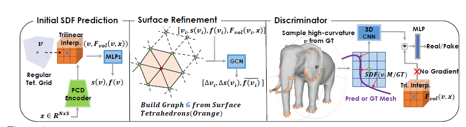

# Deep Marching Tetrahedra: a Hybrid Representation

# for High-Resolution 3D Shape Synthesis

1. 链接：[paper](https://arxiv.org/pdf/2111.04276.pdf)

2. 作用：通过点云、粗体素等生成精细的网格模型。

3. 贡献：

   - 使用可微分行进四面体作为拓扑变化层。
   - 引入结合隐式和显式表面表示的混合表示。

4. 想法：既然可以将一个二维平面划分为一个个三角形，那么就可以将三维空间划为一个个四面体。通过调整四面体生成网格，使用 GAN 的思路来生成更加真实的表面。

5. 前置内容：

   1. **判断四面体是否和物体相交以及划分四面体方法**：

      只要一个四面体的四个点的 SDF 值同时存在正值和负值，那么这个网格体和物体表面一定相交了，我们通过在四面体边中间加点来划分小四面体。中间点的 SDF 值是边上两个点 SDF 值的平均值。

      

   2. **通过四面体生成表面结构**：

      使用 MT 算法计算每个四面体中的表面拓扑结构，一共就三种情况：

      1. 四个点同号的没有表面信息。
      2. 一个点和另外三个点异号就会产生一个三角形。
      3. 两个点和另外两个点异号就会产生两个三角形。

      

6. 具体内容：

   

   

   1. **输入**：点云或粗体素，如果是粗体素就对其表面采样，生成点云。然后生成 bounding cube 和初始的四面体分割。

   2. **初始化 SDF**：使用 PVCNN 从点云提取 3D 特征体（feature volume），然后通过三线性插值得到四面体网格每个网格点的特征向量 $F_{vol}(v,x)$。然后使用 MLP 根据网格顶点的初始位置和特征向量来预测顶点所对应的 SDF 值和特征向量：$s(v),f(v)=MLP(F_{vol}(v,x),v)$。

   3. **表面提取和细化（Surface Refinement）**：在生成初始的 SDF 值后。通过上述方法判断哪些网格是跨表面的，记为 $T_{surf}$，我们建立图 $G=(V_{surf},E_{surf})$，并且用GCN 预测位置偏移和 SDF 残差：
      $$
      \begin{align}
      & f'_{v_i}=\text{concat}(v_i, s(v_i), F_{vol}(v_i,x),f(v_i))\\
      & (\Delta v_i,\Delta s(v_i), \overline{f(v_i)})_{i=1...N_{surf}}=\text{GCN}((f'_{v_i})_{i=1...N_{surf}},G)
      \end{align}
      $$
      其中 $\overline{f(v_i)}$ 是更新后的每个点的特征向量，经由：
      $$
      \begin{align}
      & v'_i=v_i+\Delta v_i\\
      & s(v'_i)=s(v_i)+\Delta s(v_i)\\
      \end{align}
      $$
      更新坐标和 SDF 值。

      **体积细分（Volume Subdivision）**：对于和表面相交的四面体 $T_{surf}$，我们根据上述方法对其进行进一步细化。

      然后我们会再次计算哪些四面体与物体的表面相交。丢弃不与物体相交的四面体节省存储，只保留与物体表面相交的四面体进行下一轮的迭代。直到细分四面体的体积接近我们想要的精度。

   4. **可学习的表面细分（Learnable Surface Subdivision）**：使用 MT 方法（见上）生成表面，然后用 GCN 引导表面优化和细分。这有助于消除量化误差并减少经典Loop细分法中的近似误差。

   5. **3D Discriminator**：随机选择高曲率的点计算真实的 SDF $S_{real}$ 以及估计的 SDF $S_{pred}$，将 $S_{real}$ 和 $S_{pred}$ 以及该点的特征向量 $F_{vol}(v,x)$ 输入到一个 3D CNN 中，该 3D CNN 将会判别输入是真实形状的概率。

7. 损失函数

   从真实的网格 $M_{gt}$ 中采样得到点集合 $P_{gt}$，从预测的网格 $M_{pred}$ 中采样得到点集合 $P_{pred}$。

   1. Surface Alignment loss: minimize the L2 Chamfer Distance and the normal consistency loss
      $$
      \begin{align}
      & L_{cd}=\Sigma_{p\in P_{pred}}\min_{q\in P_{gt}}||p-q||_2+\Sigma_{q\in P_{gt}}\min_{p\in P_{pred}}||q-p||_2\\
      & L_{normal}=\Sigma_{p\in P_{pred}}(1-|\overrightarrow{n_p}\cdot \overrightarrow{n_\hat{q}}|)
      \end{align}
      $$
      其中 $\hat{q}$ 是在计算  L2 Chamfer Distance 的时候离 p 最近的点。

   2. LSGAN 提出的 adversarial loss：
      $$
      \begin{align}
      & L_D=\frac{1}{2}[D(M_{gt}-1)^2+D(M_{pred})^2]\\
      & L_G=\frac{1}{2}[(D(M_{pred})-1)^2]\\
      \end{align}
      $$

   3. 考虑到这么做只有靠近表面的四面体能够接收到损失，因此加入 SDF Loss：
      $$
      \begin{align}
      & L_{SDF}=\Sigma_{v_i\in V_T}|s(v_i)-SDF(v_i,M_{gt})|^2\\
      & L_{def}=\Sigma_{v_i\in V_T}||\Delta v_i||_2
      \end{align}
      $$

   最终损失为：
   $$
   L=\lambda_{cd}L_{cd}+\lambda_{normal}L_{normal}+\lambda_{G}L_{G}+\lambda_{SDF}L_{SDF}+\lambda_{def}L_{def}
   $$

8. 效果

   