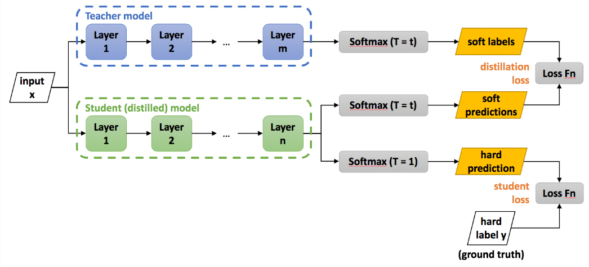

# Distilling the Knowledge in a Neural Network

1. 链接：[paper](https://arxiv.org/pdf/1503.02531.pdf)

2. 作用：压缩模型，利于部署

3. 贡献：首次提出知识蒸馏

4. 想法：

   - 模型的参数量和其能学习的知识量并非是线性关系，随着参数量的增长，模型能学习到的知识越来越少。
   - 我们想要用简单的模型去学习复杂模型的泛化能力，其中简单模型被称为“student”，复杂模型被称为“teacher”。
   - 传统的训练过程是输出后用 max probability 和 ground truth 比较，而 KD 的训练过程使用 teacher 的 class probabilities 做为 soft targets。

5. 具体内容：

   - 传统的 softmax 函数公式为：
     $$
     q_i=\frac{\exp(z_i)}{\Sigma_j\exp(z_j)}
     $$
     此时引入温度变量：
     $$
     q_i=\frac{\exp(z_i/T)}{\Sigma_j\exp(z_j/T)}
     $$
     温度越大，$q_i$ 的分布越平滑，模型就越倾向于关注负标签的信息。

   - 训练分为两个阶段：

     

     第一步是训练 Teacher。

     第二步是训练 Student，Student 的损失函数由 distill loss（对应 soft target）和 student loss（对应 hard target）加权得到：
     $$
     \begin{align}
     & L=\alpha L_{soft}+(1-\alpha)L_{hard}\\
     & where\ L_{soft}=-\Sigma_j^Np_j^T\log(q_j^T),\\
     & p_i^T=\frac{\exp(v_i/T)}{\Sigma_k^N\exp(v_k/T)},\ q_i^T=\frac{\exp(z_i/T)}{\Sigma_k^N\exp(z_k/T)},\\
     & L_{hard}=-\Sigma_j^N c_j\log(q_j^1),\ where\ q_i^1=\frac{\exp(z_i)}{\Sigma_k^N\exp(z_k)}
     \end{align}
     $$
     实验发现第二部分所占比重比较小的时候，能产生最好的结果，这是一个经验的结论。
     
     

   

# Probabilistic Knowledge Transfer

1. 链接：[paper](https://arxiv.org/pdf/1803.10837.pdf)

2. 改进：

   该方法除了性能超越现有的蒸馏技术外， 还可以克服它们的一些局限性。包括：

   - 之前的方法主要是迁移 logit 知识，而 PKT 可以实现直接转移不同架构/维度层之间的知识。
   - 现有的蒸馏技术通常会忽略教师特征空间的几何形状，因为它们仅使学生网络学习教师网络的输出结果。而 PKT 算法能够有效地将教师模型的特征空间结构映射到学生的特征空间中，从而提高学生模型的准确性。

3. 具体做法：

   令 $\mathcal{T}={t1,t2,...,t_N}$ 为数据集，$x=f(t)$ 代表 teacher 的输出，$y=g(t,W)$ 代表 student 输出，W 表示 student 的参数。

   然后我们需要建模 teacher 和 student 之间的数据分布：
   $$
   \begin{align}
   & p_{ij}=p_{i|j}p_j=K(x_i,x_j;2\sigma_t^2)\\
   & q_{ij}=q_{i|j}q_j=K(y_i,y_j;2\sigma_s^2)\\
   & p_{i|j}=\frac{K(x_i,x_j;2\sigma_t^2)}{\Sigma_{k=1,k\neq j}^N K(x_k,x_j;2\sigma_t^2)}\in[0,1]\\
   & q_{i|j}=\frac{K(y_i,y_j;2\sigma_s^2)}{\Sigma_{k=1,k\neq j}^N K(y_k,y_j;2\sigma_s^2)}\in[0,1]
   \end{align}
   $$
   其中 K 最经典的函数是高斯分布（对于高维空间也可以算余弦相似度）。

   对于分布距离的计算则可以使用 KL 散度来计算

   因此最终的损失函数为：
   $$
   \mathcal{L}=\Sigma_{i=1}^N\Sigma_{j=1,i\ne j}^N p_{j|i}\log(\frac{p_{j|i}}{q_{j|i}})
   $$
