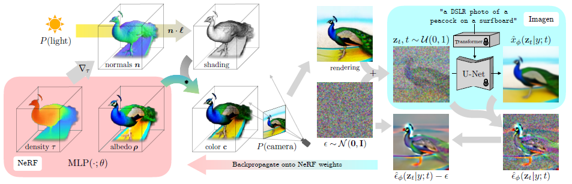
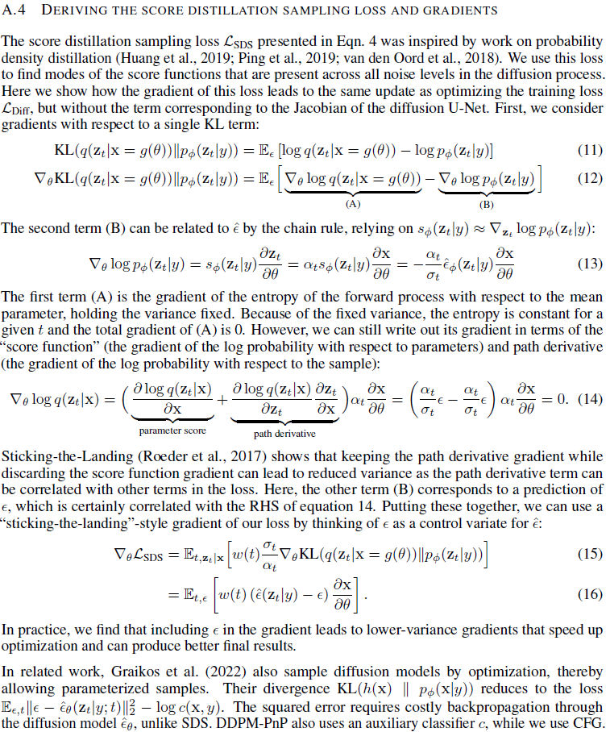

# DreamFusion

1. 链接：[paper]([2209.14988.pdf (arxiv.org)](https://arxiv.org/pdf/2209.14988.pdf))

2. 作用：在没有 3D 数据做监督的前提下，如何把已有的文生图用起来，并根据给定的文本生成想要的3D模型（既要geometry，也要texture）

3. 贡献：
   - 提出 Score Distillation Sampling。SDS 的核心作用是在优化过程中减少梯度的方差，从而提高训练效率和模型性能。

4. 大致思路：
   - 生成：采用谷歌的 Imagen，Imagen 通过 DM 可以实现文生图。在图像的生成过程中，不同视角的生成受到文本中与方向有关的描述所控制。
   - 表示：对于生成对象的 3D 表示，DreamFusion 采用了 Mip-NeRF，当然也可以采用其他架构。
   - 训练：2D 扩散模型可以作为优化参数化图像生成器的先验。通过使用这种损失优化一个随机初始化的 3D 模型。

5. 具体内容：

   

   - 渲染 NeRF 图像：随机初始化 NeRF、光源方向。NeRF 输出 density 以及 albedo，然后使用 density 的梯度得到 normals。根据光源方向和法线信息可以得到 shading 信息（如图，只是简单的一个法线点乘光源方向，在同一个方向就最亮），shading 信息和 albedo 相乘得到最终 color，然后随机初始化一个相机参数来渲染一张图像（rendering）。

   - 应用扩散模型：对渲染出的图像逐步增加高斯噪声，然后根据 text embedding 经过 U-Net 对图像进行去噪。

   - 计算噪声残差：在每个噪声层次上，扩散模型的输出（去噪后的图像）与其输入（带噪声的图像）相减，得到 U-Net 预测的噪声。然后，将这个预测的噪声与初始添加的噪声做差，得到每个时间步 t 的噪声残差。
     $$
     \mathcal{L}_{Diff}(\phi,x)=\mathbb{E}_{t\sim\mathcal{U}(0,1),\epsilon\sim\mathcal{N}(0,1)}[w(t)||\epsilon_\phi(z_t;t,y)-\epsilon||_2^2]\\\tag{1}
     $$

   - ==梯度回传和 NeRF 参数更新==：这些噪声残差用于计算损失函数的梯度，并通过反向传播更新 NeRF 模型的参数。这个过程使得 NeRF 渲染的图像更接近于扩散模型生成的图像，从而优化 3D 场景以匹配给定的文本描述。

     原文认为：diffusion models trained on pixels have traditionally been used to sample only pixels. We are not interested in sampling pixels; we instead want to create 3D models that look like good images when rendered from random angles. Such models can be specified as a differentiable image parameterization。

     在传统的图像生成模型中，如生成对抗网络（GANs）或变分自编码器（VAEs），模型直接输出像素值来构成图像。而在可微分图像参数化的方法中，图像是通过一组参数控制的，这些参数定义了图像的生成过程。例如，这些参数可以是控制图像中对象形状、位置、纹理、光照等方面的因素。例如在 NeRF 中，$\theta$ 代表 NeRF、光源、相机的参数，$g$ 代表 Volume Rendering 的过程。那么生成的图像就可以表示为 $x=g(\theta)$。这样可以约束更多的条件并且可以用基于梯度优化的方法来调整参数。

     但是他们发现直接用式 (1) 来对 NeRF 梯度下降效果并不理想，他们的推理是：
     $$
     \begin{align}
     & \nabla\mathcal{L}_{Diff}(\phi,x)\\
     & =\mathbb{E}_{t\sim\mathcal{U}(0,1),\epsilon\sim\mathcal{N}(0,1)}[w(t)(\epsilon_\phi(z_t;t,y)-\epsilon)\frac{\partial{\epsilon_\phi(z_t;t,y)}}{\partial z_t}\frac{\partial z_t}{\partial x}\frac{\partial x}{\partial \theta}]\\
     
     & =\mathbb{E}_{t\sim\mathcal{U}(0,1),\epsilon\sim\mathcal{N}(0,1)}[w(t)(\epsilon_\phi(z_t;t,y)-\epsilon)\frac{\partial{\epsilon_\phi(z_t;t,y)}}{\partial z_t}\alpha_t I\frac{\partial x}{\partial \theta}]\\
     
     & =\mathbb{E}_{t\sim\mathcal{U}(0,1),\epsilon\sim\mathcal{N}(0,1)}[w'(t)\underbrace{(\epsilon_\phi(z_t;t,y)-\epsilon)}_{\text{Noise Residual}}\underbrace{\frac{\partial{\epsilon_\phi(z_t;t,y)}}{\partial z_t}}_{\text{U-Net Jacobian}}\underbrace{\frac{\partial x}{\partial \theta}}_{\text{Generator Jacobian}}]\\
     \end{align}
     $$
     然后他们发现在噪声比较小的层次 U-Net Jacobian 项不太稳定，删去效果更好，因此最终的损失函数梯度为：
     $$
     \begin{align}
     & \nabla_\theta\mathcal{L}_{SDS}(\phi,x)=\mathbb{E}_{t\sim\mathcal{U}(0,1),\epsilon\sim\mathcal{N}(0,1)}[w'(t)\underbrace{(\epsilon_\phi(z_t;t,y)-\epsilon)}_{\text{Noise Residual}}\underbrace{\frac{\partial x}{\partial \theta}}_{\text{Generator Jacobian}}]\\
     \end{align}
     $$
     虽然这个式子有点 adhoc，但是他们之后证明了这其实是概率密度蒸馏损失的梯度，即：
     $$
     \begin{align}
     &\nabla_\theta\mathcal{L}_{SDS}(\phi,x=g(\theta))=\\
     &\nabla_\theta\mathbb{E}_t[\sigma_t/\alpha_t w(t)\ \rm{KL}(q(z_t|g(\theta);y,t)||p_\phi(z_t;y,t))]
     \end{align}
     $$

6. 证明方法在原论文附录 A.4：

   