# Fantasia3D: Disentangling Geometry and Appearance for High-quality Text-to-3D Content Creation Survey

徐晖曜

[TOC]

## Fantasia3D: Disentangling Geometry and Appearance for High-quality Text-to-3D Content Creation

1. 这篇文章用了 [DMTet](#DMTet) 和 [SDS](#DreamFusion)， DMTet 用了 [PVCNN](#PVCNN)，建议先阅读下面的  DMTet 和 DreamFusion 调研报告。

2. 论文链接：[Paper](https://arxiv.org/pdf/2303.13873.pdf)；项目链接：[Code](https://fantasia3d.github.io/)

3. 作者：Rui Chen, Yongwei Chen, Ningxin Jiao, Kui Jia

4. 背景

   对三维表面和材质纹理进行建模学习是实现三维内容生成的基础。现有方法多基于隐式表面表达，并耦合表面与材质纹理学习，通过体渲染的方式实现从二维图像到三维形状的关联，进而实现三维内容自动生成；但这种耦合造成精细的表面几何难以恢复，也无法进行真实感表面渲染。

5. 工作

   高质量三维内容生成：解耦表面几何与材质纹理学习，并基于混合表面表征实现精细化的表面几何与颜色生成，并能够与现有图形学管线无缝衔接。

6. 贡献

   - 使用法线图作为 Shape encoding 的输入。
   - 首次在 text-to-3D 工作中引入 BRDF
   -  模型。

7. 大致想法

   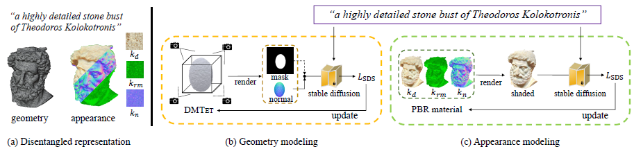

   - 使用一个预训练的文生图模型（Stable Diffusion）。
   - 用 DMTet 生成法线图和 Mask，输入 stable diffusion 后通过 SDS 梯度下降。
   - 使用 SVBRDF 模型渲染，输入 stable diffusion 后通过 SDS 梯度下降。

8. 具体内容

   1. **初始化 DMTet**：要么初始化为一个椭球，要么用指定的模型初始化。然后我们用一个 MLP（参数为 $\Phi$）去预测空间中的 SDF 值，具体做法是在初始化的模型周围采样，用：
      $$
      \mathcal{L}_{SDF}=\Sigma_{p_i\in P}||s(p_i;\Phi)-SDF(p_i)||_2^2
      $$
      作为损失函数梯度下降。

   2. **几何建模**：已经得到了 DMTet 的参数 $\Phi$，使用可微渲染器生成法向图和掩膜：
      $$
      (n,o)=g_n(\Phi,c)
      $$
      其中 $c$ 是随机采样的一个相机，$g_n$ 是可微渲染器。然后将法线图和掩膜输入到 Stable Diffusion 中，之后用 SDS 梯度下降：
      $$
      \nabla_\Phi\mathcal{L}(\phi,\tilde{n})=\mathbb{E}[w(t)(\hat{\epsilon}_\phi(z_t^{\tilde{n}};y,t)-\epsilon)\frac{\partial \tilde{n}}{\partial \Phi}\frac{\partial z_t^{\tilde{n}}}{\partial \tilde{n}}]
      $$
      其中 $\phi$ 是预训练的 Stable Diffusion 的参数；$\tilde{n}$ 是法线图和掩膜的拼接；$\hat{\epsilon}_\phi(z_t^{\tilde{n}};y,t)$ 是预测的噪声，$\epsilon$ 是真正加上去的噪声。

      在训练过程中，论文采用了 coarse-to-fine 策略，即一开始输入的是下采样的 $\tilde{n}$，在后半个训练阶段输入高分辨率的 $n$（没有掩膜）。

      ==为什么输入法线图能 work？==

   3. **外观建模**：引入 PBR，有四张贴图，分别是 diffuse 项（记为 $k_d$）、roughness 项、metallic 项、normal（记为 $k_n$） 项。因为 roughness 和 metallic 是单通道的所以压缩在一个二通道贴图 $k_{rm}$ 中。

      论文使用一个 MLP 网络 $\Gamma$ 来生成这些项：
      $$
      (k_d,k_rm,k_n)=\Gamma(\beta(p);\gamma)
      $$
      其中 $\beta$ 是位置编码，$\gamma$ 是 MLP 参数。

      渲染方程为：
      $$
      \begin{align}
      & L_s(p,w_o)=\int_\Omega \frac{DFG}{4(w_o\cdot n)(w_i\cdot n)}L_i(p,w_i)(n\cdot w_i)dw_i+\\
      &(1-m)k_d\int_\Omega L_i(p,w_i)(n\cdot w_i)dw_i
      \end{align}
      $$
      在论文中使用 split-sum 的方法来预计算和渲染场景。

      同样地，将渲染的图像输入到 Stable Diffusion 中，然后使用 SDS 梯度下降：
      $$
      \nabla_\gamma\mathcal{L}_{SDS}(\phi,x)=\mathbb{E}[w(t)(\hat{\epsilon}_\phi(z_t^x;y,t)-\epsilon)\frac{\partial x}{\partial \gamma}\frac{\partial z^x}{\partial x}]
      $$

   4. **纹理生成**：使用 xatlas（模型 uv 展开到 2D 平面上的一个类库） 生成 UV map。

9. 效果

   1. Zero-shot generation（初始化形状是一个椭球）

      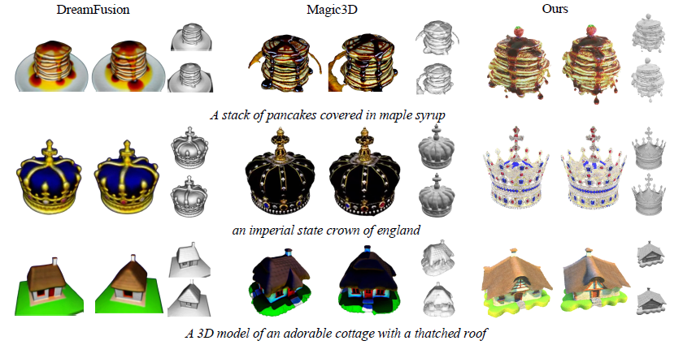

   2. User-guided generation（用户自定义初始形状）

      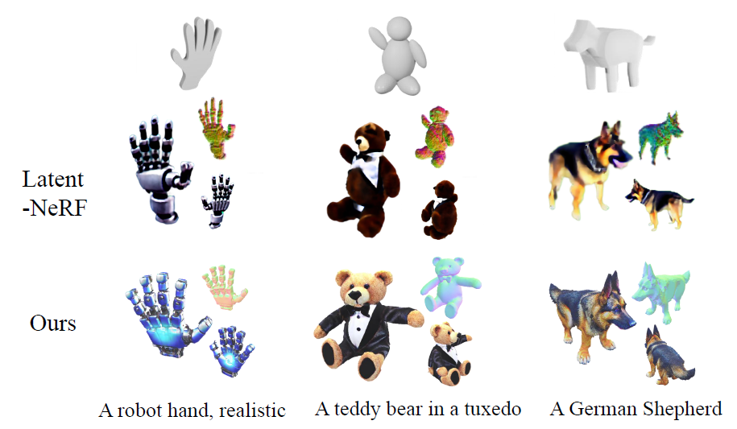

   3. Scene editing and simulation

      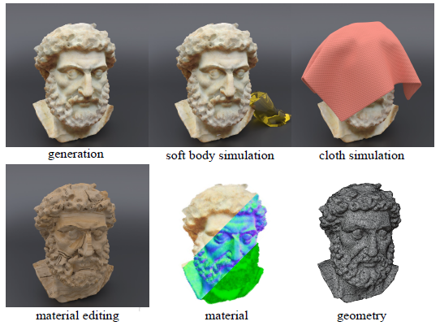

10. 不足

    1. 无法生成松散的拓扑结构（例如头发、毛皮和草）。
    2. 缺乏根据文本提示生成带有背景的完整场景的能力。

## Deep Marching Tetrahedra: a Hybrid Representation for High-Resolution 3D Shape Synthesis

1. 链接：[Paper](https://arxiv.org/pdf/2111.04276.pdf)

2. 作用：通过点云、粗体素等生成精细的网格模型。

3. 贡献：

   - 使用可微分行进四面体作为拓扑变化层。
   - 引入结合隐式和显式表面表示的混合表示。

4. 想法：既然可以将一个二维平面划分为一个个三角形，那么就可以将三维空间划为一个个四面体。通过调整四面体生成网格，使用 GAN 的思路来生成更加真实的表面。

5. 前置内容：

   1. **判断四面体是否和物体相交以及划分四面体方法**：

      只要一个四面体的四个点的 SDF 值同时存在正值和负值，那么这个网格体和物体表面一定相交了，我们通过在四面体边中间加点来划分小四面体。中间点的 SDF 值是边上两个点 SDF 值的平均值。

      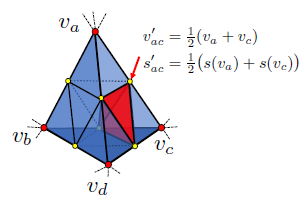

   2. **通过四面体生成表面结构**：

      使用 MT 算法计算每个四面体中的表面拓扑结构，一共就三种情况：

      1. 四个点同号的没有表面信息。
      2. 一个点和另外三个点异号就会产生一个三角形。
      3. 两个点和另外两个点异号就会产生两个三角形。

      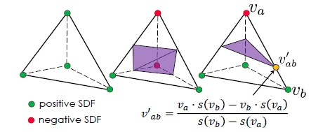

6. 具体内容：

   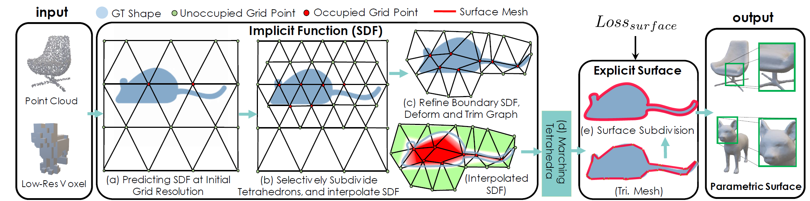

   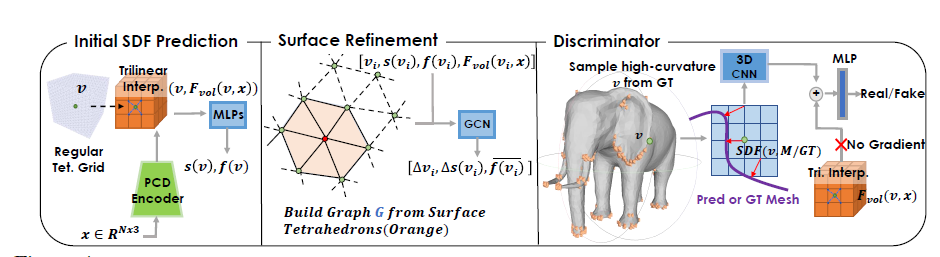

   1. **输入**：点云或粗体素，如果是粗体素就对其表面采样，生成点云。然后生成 bounding cube 和初始的四面体分割。

   2. **初始化 SDF**：使用 [PVCNN](#PVCNN) 从点云提取 3D 特征体（feature volume），然后通过三线性插值得到四面体网格每个网格点的特征向量 $F_{vol}(v,x)$。然后使用 MLP 根据网格顶点的初始位置和特征向量来预测顶点所对应的 SDF 值和特征向量：$s(v),f(v)=MLP(F_{vol}(v,x),v)$。

   3. **表面提取和细化（Surface Refinement）**：在生成初始的 SDF 值后。通过上述方法判断哪些网格是跨表面的，记为 $T_{surf}$，我们建立图 $G=(V_{surf},E_{surf})$，并且用 [GCN](https://zhuanlan.zhihu.com/p/71200936) 预测位置偏移和 SDF 残差：
      $$
      \begin{align}
      & f'_{v_i}=\text{concat}(v_i, s(v_i), F_{vol}(v_i,x),f(v_i))\\
      & (\Delta v_i,\Delta s(v_i), \overline{f(v_i)})_{i=1...N_{surf}}=\text{GCN}((f'_{v_i})_{i=1...N_{surf}},G)
      \end{align}
      $$
      其中 $\overline{f(v_i)}$ 是更新后的每个点的特征向量，经由：
      $$
      \begin{align}
      & v'_i=v_i+\Delta v_i\\
      & s(v'_i)=s(v_i)+\Delta s(v_i)\\
      \end{align}
      $$
      更新坐标和 SDF 值。

      **体积细分（Volume Subdivision）**：对于和表面相交的四面体 $T_{surf}$，我们根据上述方法对其进行进一步细化。

      然后我们会再次计算哪些四面体与物体的表面相交。丢弃不与物体相交的四面体节省存储，只保留与物体表面相交的四面体进行下一轮的迭代。直到细分四面体的体积接近我们想要的精度。

   4. **可学习的表面细分（Learnable Surface Subdivision）**：使用 MT 方法（见上）生成表面，然后用 GCN 引导表面优化和细分。这有助于消除量化误差并减少经典Loop细分法中的近似误差。

   5. **3D Discriminator**：随机选择高曲率的点计算真实的 SDF $S_{real}$ 以及估计的 SDF $S_{pred}$，将 $S_{real}$ 和 $S_{pred}$ 以及该点的特征向量 $F_{vol}(v,x)$ 输入到一个 3D CNN 中，该 3D CNN 将会判别输入是真实形状的概率。

7. 损失函数

   从真实的网格 $M_{gt}$ 中采样得到点集合 $P_{gt}$，从预测的网格 $M_{pred}$ 中采样得到点集合 $P_{pred}$。

   1. Surface Alignment loss: minimize the L2 Chamfer Distance and the normal consistency loss
      $$
      \begin{align}
      & L_{cd}=\Sigma_{p\in P_{pred}}\min_{q\in P_{gt}}||p-q||_2+\Sigma_{q\in P_{gt}}\min_{p\in P_{pred}}||q-p||_2\\
      & L_{normal}=\Sigma_{p\in P_{pred}}(1-|\overrightarrow{n_p}\cdot \overrightarrow{n_\hat{q}}|)
      \end{align}
      $$
      其中 $\hat{q}$ 是在计算  L2 Chamfer Distance 的时候离 p 最近的点。

   2. LSGAN 提出的 adversarial loss：
      $$
      \begin{align}
      & L_D=\frac{1}{2}[D(M_{gt}-1)^2+D(M_{pred})^2]\\
      & L_G=\frac{1}{2}[(D(M_{pred})-1)^2]\\
      \end{align}
      $$

   3. 考虑到这么做只有靠近表面的四面体能够接收到损失，因此加入 SDF Loss：
      $$
      \begin{align}
      & L_{SDF}=\Sigma_{v_i\in V_T}|s(v_i)-SDF(v_i,M_{gt})|^2\\
      & L_{def}=\Sigma_{v_i\in V_T}||\Delta v_i||_2
      \end{align}
      $$

   最终损失为：
   $$
   L=\lambda_{cd}L_{cd}+\lambda_{normal}L_{normal}+\lambda_{G}L_{G}+\lambda_{SDF}L_{SDF}+\lambda_{def}L_{def}
   $$

8. 效果

   

## DreamFusion

1. 链接：[Paper]([2209.14988.pdf (arxiv.org)](https://arxiv.org/pdf/2209.14988.pdf))

2. 作用：在没有 3D 数据做监督的前提下，如何把已有的文生图用起来，并根据给定的文本生成想要的3D模型（既要geometry，也要texture）

3. 贡献：

   - 提出 Score Distillation Sampling。SDS 的核心作用是在优化过程中减少梯度的方差，从而提高训练效率和模型性能。

4. 大致思路：

   - 生成：采用谷歌的 Imagen，Imagen 通过 DM 可以实现文生图。在图像的生成过程中，不同视角的生成受到文本中与方向有关的描述所控制。
   - 表示：对于生成对象的 3D 表示，DreamFusion 采用了 Mip-NeRF，当然也可以采用其他架构。
   - 训练：2D 扩散模型可以作为优化参数化图像生成器的先验。通过使用这种损失优化一个随机初始化的 3D 模型。

5. 具体内容：

   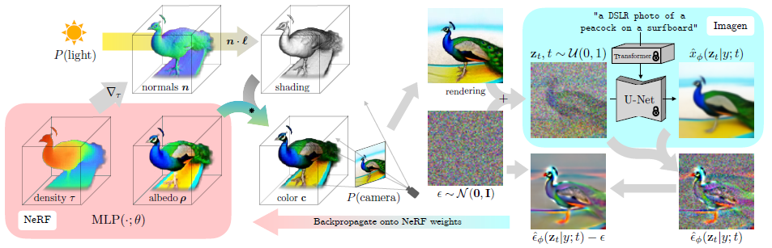

   - **渲染 NeRF 图像**：随机初始化 NeRF、光源方向。NeRF 输出 density 以及 albedo，然后使用 density 的梯度得到 normals。根据光源方向和法线信息可以得到 shading 信息（如图，只是简单的一个法线点乘光源方向，在同一个方向就最亮），shading 信息和 albedo 相乘得到最终 color，然后随机初始化一个相机参数来渲染一张图像（rendering）。

   - **应用扩散模型**：对渲染出的图像逐步增加高斯噪声，然后根据 text embedding 经过 U-Net 对图像进行去噪。

   - **计算噪声残差**：在每个噪声层次上，扩散模型的输出（去噪后的图像）与其输入（带噪声的图像）相减，得到 U-Net 预测的噪声。然后，将这个预测的噪声与初始添加的噪声做差，得到每个时间步 t 的噪声残差。
     $$
     \mathcal{L}_{Diff}(\phi,x)=\mathbb{E}_{t\sim\mathcal{U}(0,1),\epsilon\sim\mathcal{N}(0,1)}[w(t)||\epsilon_\phi(z_t;t,y)-\epsilon||_2^2]\\\tag{1}
     $$

   - **梯度回传和 NeRF 参数更新**：这些噪声残差用于计算损失函数的梯度，并通过反向传播更新 NeRF 模型的参数。这个过程使得 NeRF 渲染的图像更接近于扩散模型生成的图像，从而优化 3D 场景以匹配给定的文本描述。

     原文认为：diffusion models trained on pixels have traditionally been used to sample only pixels. We are not interested in sampling pixels; we instead want to create 3D models that look like good images when rendered from random angles. Such models can be specified as a differentiable image parameterization。

     在传统的图像生成模型中，如生成对抗网络（GANs）或变分自编码器（VAEs），模型直接输出像素值来构成图像。而在可微分图像参数化的方法中，图像是通过一组参数控制的，这些参数定义了图像的生成过程。例如，这些参数可以是控制图像中对象形状、位置、纹理、光照等方面的因素。例如在 NeRF 中，$\theta$ 代表 NeRF、光源、相机的参数，$g$ 代表 Volume Rendering 的过程。那么生成的图像就可以表示为 $x=g(\theta)$。这样可以约束更多的条件并且可以用基于梯度优化的方法来调整参数。

     但是他们发现直接用式 (1) 来对 NeRF 梯度下降效果并不理想，他们的推理是：
     $$
     \begin{align}
     & \nabla\mathcal{L}_{Diff}(\phi,x)\\
     & =\mathbb{E}_{t\sim\mathcal{U}(0,1),\epsilon\sim\mathcal{N}(0,1)}[w(t)(\epsilon_\phi(z_t;t,y)-\epsilon)\frac{\partial{\epsilon_\phi(z_t;t,y)}}{\partial z_t}\frac{\partial z_t}{\partial x}\frac{\partial x}{\partial \theta}]\\
     
     & =\mathbb{E}_{t\sim\mathcal{U}(0,1),\epsilon\sim\mathcal{N}(0,1)}[w(t)(\epsilon_\phi(z_t;t,y)-\epsilon)\frac{\partial{\epsilon_\phi(z_t;t,y)}}{\partial z_t}\alpha_t I\frac{\partial x}{\partial \theta}]\\
     
     & =\mathbb{E}_{t\sim\mathcal{U}(0,1),\epsilon\sim\mathcal{N}(0,1)}[w'(t)\underbrace{(\epsilon_\phi(z_t;t,y)-\epsilon)}_{\text{Noise Residual}}\underbrace{\frac{\partial{\epsilon_\phi(z_t;t,y)}}{\partial z_t}}_{\text{U-Net Jacobian}}\underbrace{\frac{\partial x}{\partial \theta}}_{\text{Generator Jacobian}}]\\
     \end{align}
     $$
     然后他们发现在噪声比较小的层次 U-Net Jacobian 项不太稳定，删去效果更好，因此最终的损失函数梯度为：
     $$
     \begin{align}
     & \nabla_\theta\mathcal{L}_{SDS}(\phi,x)=\mathbb{E}_{t\sim\mathcal{U}(0,1),\epsilon\sim\mathcal{N}(0,1)}[w'(t)\underbrace{(\epsilon_\phi(z_t;t,y)-\epsilon)}_{\text{Noise Residual}}\underbrace{\frac{\partial x}{\partial \theta}}_{\text{Generator Jacobian}}]\\
     \end{align}
     $$
     虽然这个式子有点 adhoc，但是他们之后证明了这其实是概率密度蒸馏损失的梯度，即：
     $$
     \begin{align}
     &\nabla_\theta\mathcal{L}_{SDS}(\phi,x=g(\theta))=\\
     &\nabla_\theta\mathbb{E}_t[\sigma_t/\alpha_t w(t)\ \rm{KL}(q(z_t|g(\theta);y,t)||p_\phi(z_t;y,t))]
     \end{align}
     $$

6. 证明方法在原论文附录 A.4：

   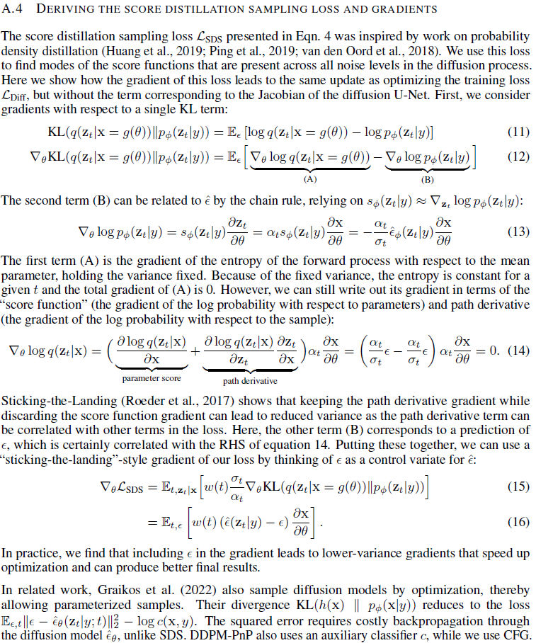

7. 效果：

   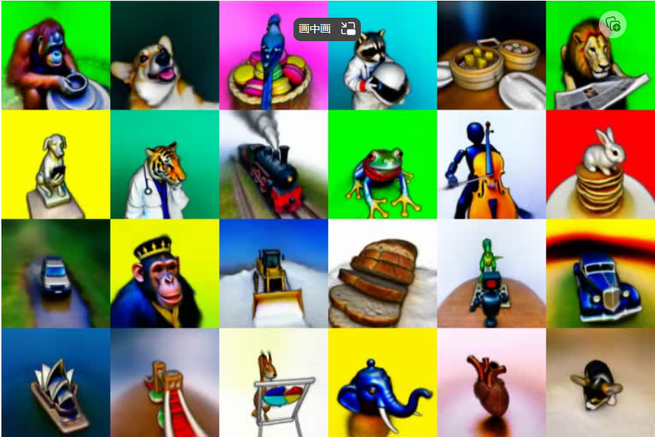

## Point-Voxel CNN for Efficient 3D Deep Learning

1. 链接：[Paper](https://arxiv.org/pdf/1907.03739.pdf)

2. 背景：

   三维深度学习运用广泛，以前的做法是将点云扩充为 voxel，然后在 voxel 内标注信息。但是三维的卷积在高分辨率场景下运行非常慢。而只是用低分辨率下会丢失很多信息。

   而如果直接使用点云，那么随机访问以及卷积时根据点之间的距离调整权重会花费非常多的时间。

3. 作用：减少三维深度学习开销。

4. 贡献：提出 Point-Voxel Convolution，一种新的三维卷积操作。

5. 想法：

   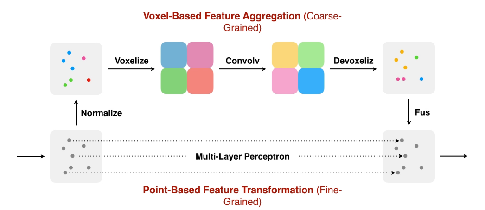

   有两个分支，其中一个分支直接将点云一一映射，类似于 1x1 的卷积核。另外一个分支首先将点云格点化，然后使用卷积，然后再回到点云。最后将两者结果混合即可。

6. 关注点可视化：

   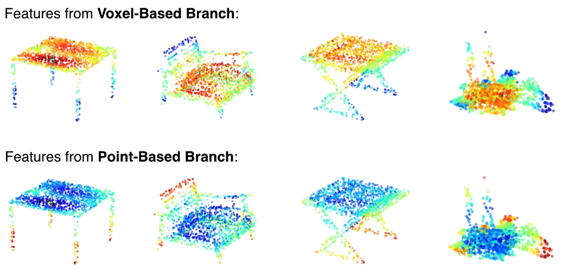

   Voxel 分支更关注大块的物体，Point 分支更关注细小的物体。