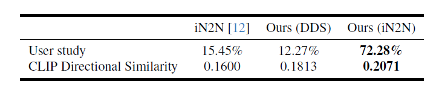

# GaussianEditor

论文链接：[[2311.14521\] GaussianEditor: Swift and Controllable 3D Editing with Gaussian Splatting (arxiv.org)](https://arxiv.org/abs/2311.14521)

## 工作

基于文本对已经重建好的 3D 高斯场景进行编辑，包括增删改。

## 背景

1. NeRF 是隐式表达空间信息，难以对其中的三维信息进行编辑。
2. 3D Gaussian 虽然是显示表达，但是面临以下问题：
   1. 如何识别每种语义的物体分别包含了哪些 3D 高斯？
   2. 随机梯度直接回传到高斯点会导致一系列不稳定因素。
   3. 3D 高斯变量很多，灵活性很强，在使用 SDS 这样的生成式引导时难以在细节处收敛。

## 贡献

1. 提出通过已有的 2D 分割模型对每个 3D 高斯点进行语义追踪的方法。
2. 提出 Hierarchical Gaussian Splatting（HGS）来保证高斯点群在训练变化时仍然会保留原有的结构。
3. 设计了一个编辑 3D 高斯场景的算法来删除、添加、更改场景中的物体。

## 大致想法

1. 首先根据多个视角的图片用 3D 高斯重建出一个三维场景。
2. 计算高斯点 $i$ 属于 label $j$ 的权重，超过阈值即认为高斯点 $i$ 属于 label $j$。
3. 使用层级高斯，最初的高斯点辈分最老，每次迭代新生成的高斯点辈分越来越年轻。训练时增加一个损失函数，辈分越年轻，越可以不像最初的高斯点。
4. 对场景编辑：
   1. 通过 label 对物体进行删除。
   2. 通过 Inpainting 技术生成一个视角下的图片、然后转成三维，最后对齐坐标。
   3. 通过 label 选出要修改的高斯，使用 Diffusion Guidance 修改对应高斯点。

## 细节

### 语义识别

从多个不同的角度观察场景，每个点的 label 计算公式为：
$$
w_i^j=\sum_m o_i(p)\cdot T_i(p)\cdot \mathcal{M}^j(p)
$$
其中：

- $w_i^j$ 是高斯点 $i$ 属于 label $j$ 的权重。
- $o_i(p)$ 是高斯点 $i$ 在 pixel $p$ 下的不透明度（opacity）。 
- $T_i(p)$ 是高斯点 $i$ 在 pixel $p$ 下的投射比（transmittance）。 
- $\mathcal{M}^j(p)$ 是 pixel $p$ 是否属于 label $j$，是一个 0-1 Mask。

引用论文：[[2304.02643\] Segment Anything (arxiv.org)](https://arxiv.org/abs/2304.02643)

### 层级高斯

最初的高斯点标记为 $0$，第 $k$ 次迭代产生的高斯点标记为 $k$，我们记：
$$
\begin{align}
& \mathcal{L}=\mathcal{L}_{Edit}+\sum_{P\in\{x,s,q,\alpha,c\}}\lambda_P\mathcal{L}_{anchor}^P\\
& \mathcal{L}_{anchor}^P=\sum_{i=0}^n\lambda_i(P_i-\hat{P_i})^2
\end{align}
$$
其中：

- $x,s,q,\alpha,c$ 是高斯点的参数均值、缩放矩阵、旋转矩阵、不透明度、颜色。
- $\lambda_P$ 是超参数用于平衡各个参数之间的 loss。
- $\lambda_i$ 也是一个超参数，它随着高斯点的代数 $k$ 增大而减小。

通过 $\lambda_i$ 这个参数，被修改的部分可以在迭代时保持原有的结构而不会过度流动。除此之外，他们还限定每次迭代只优化梯度大小为前 $q\%$ 的高斯点。

### 删除

已经计算出每个高斯点 $i$ 属于 label $j$ 了，我们只需要删除所有属于 label $j$ 的高斯点即可。

但是这样做有瑕疵，特别是在物体的交界处，因为计算 label 的视角有限并且一个像素点会有很多个高斯点对其有贡献，因此我们可能少删除或者多删除。除此以外删除物体后可能会造成空洞（那里没点了），因此我们需要做以下修正：

首先用 K 近邻算法来识别被删除高斯周围的一些高斯点，将这些高斯点投影到多个不同的视角上作为 Mask 使用 2D Inpainting 技术进行修复。然后重建出需要填充的高斯点填充上去。（没有详细介绍，我的猜测是首先随机化高斯，从同样的几个视角去渲染，然后用 MSE 去优化高斯）

在 RTX A6000 下，删除过程耗时 2 分钟左右。

### 添加

用户需要在某个相机位姿 $I$ 下渲染出的图像中选出一个 2D Mask $M$ 来指定我需要将物体添加到哪里。除此之外，用户需要给一个 Prompt $y$ 来指定添加什么东西。

首先我们生成一个 2D 修复图像 $I^My$，然后将前景物体提取出来用一个 image-to-3D 的方法来生成一个三维网格体，然后转成 3D 高斯点。

现在需要将这些 3D 高斯点放到原来的场景中，我们首先估计 $I^My$ 相较于相机的深度，引用论文：[[2103.13413\] Vision Transformers for Dense Prediction (arxiv.org)](https://arxiv.org/abs/2103.13413)，然后使用最小二乘法来对齐坐标。

在 RTX A6000 下，删除过程耗时 5 分钟左右。

### 修改

首先根据语义选出需要修改的 3D Gaussian，梯度下降只对这些 3D Gaussian 有效。

然后使用任意的 Diffusion-Based Editing Methods 对三维模型做引导，例如 SDS Loss。根据场景的复杂度采样 24 到 96 个视角，一般迭代 500-1000 次。

在 RTX A6000 下，删除过程耗时 5-10 分钟左右。

## 实验

### 效果

### 消融实验

### 对比试验

## 不足

1. 不支持复杂的 Prompt。
2. 无法处理光照阴影，并且 HGS 的使用使得其看起来像是两个模型插值，因此一眼假。
3. 有一些噪声，初步猜测原因有：
   - 随机梯度。
   - 每次更新时只更新梯度 top k 的点，有一些点一直没更新。

