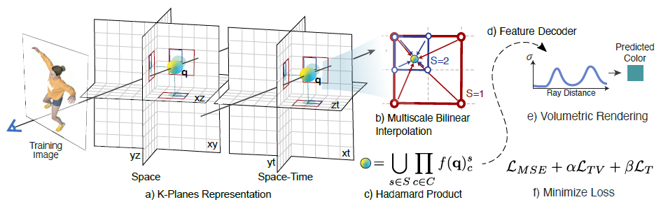
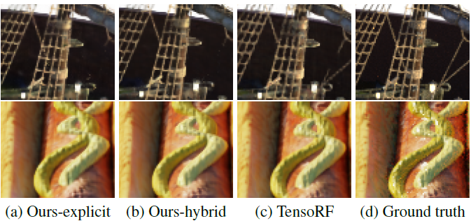
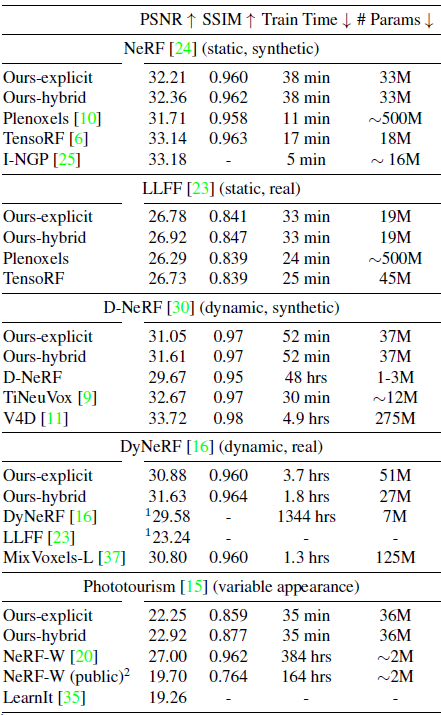
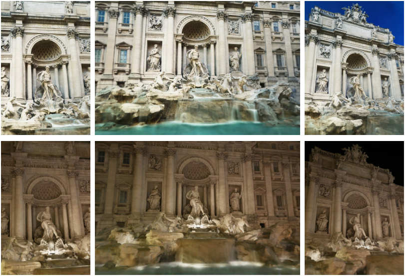
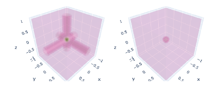

# K-Planes: Explicit Radiance Fields in Space, Time, and Appearance

[TOC]

## 工作

静态场景、动态场景、外观变化场景的重建，可解释（？）并且内存开销小。

## 大致思路

1. 对于 $4$ 维场景（$x,y,z,t$），初始化 $C_4^2=6$ 个平面（$xy,xz,yz,xt,yt,zt$）。每个平面的大小为 $N\times N\times M$，其中 $N$ 是分辨率，$M$ 是特征向量维度。
2. 对于一个点 $q=(i,j,k,\tau)$，将 $q$ 的坐标投影到六个平面上然后做双线性插值得到每个平面的特征向量 $f(q)_c$。然后对 $f(q)_c$ 做 Hadamard 积得到这个点的特征向量 $f(q)=\prod_{c\in C}f(q)_c$。
3. 然后使用一个 Decoder 得到这个点的颜色和密度，之后就是传统的体渲染方法。

## 实现细节

### 压缩

它使用了 Multiscale Layer，每个平面采用 LoD 的想法，分为 $64,128,256\cdots$ 等分辨率的多个平面。每次取特征向量的时候是在所有层分别计算特征向量，然后合并成一个特征向量。

这个做法减少了最高分辨率需要存储的特征维度。同时经过实验发现，Multiscale Layer 对空间三平面有作用，对时空三平面没啥作用。

### 优化

- Total variation in space

  它希望空间上的表达是连续的，因此引入正则化：
  $$
  \mathcal{L}_{TV}(P)=\frac{1}{|C|n^2}\sum_{c,i,j}(||P_c^{i,j}-P_c^{i-1,j}||_2^2+||P_c^{i,j}-P_c^{i,j-1}||_2^2)
  $$
  尽管总体上鼓励平滑性，但通过适当的正则化强度，模型仍然可以保留场景中的关键特征和边缘。

- Smoothness in time

  它希望物体的移动是平滑的，不会突变：
  $$
  \mathcal{L}_{smooth}(P)=\frac{1}{|C|n^2}\sum_{c,i,t}||P_c^{i,t-1}-2P_c^{i,t}+P_c^{i,t+1}||_2^2
  $$
  一阶导代表速度，二阶导代表加速度。

- Sparse transients

  鼓励空间-时间平面的特征向量在静态区域保持恒定，来帮助模型区分场景中的静态和动态部分：
  $$
  \mathcal{L}_{sep}(P)=\sum_c||1-P_c||_1
  $$

### 解码

1. 线性解码器

   之前的 view-dependent color 都是用球谐函数来表达的，但是球谐函数比较难优化，并且球谐函数的阶数限制了其表征能力。

   线性解码器使用学习到的基（basis）来解码。其通过一个小型 MLP 来映射每个视角方向 $d$ 到红色 $b_R(d)$、绿色 $b_G(d)$ 和蓝色 $b_B(d)$ 的基向量。然后使用
   $$
   c(q,d)=\bigcup_{i\in\{R,G,B\}}f(q)\cdot b_i(d)
   $$
   然后用同种方式生成密度 $\sigma$。

2. MLP 解码器
   $$
   \begin{align}
   & \sigma(q),\hat{f}(q)=g_\sigma(f(q))\\
   & c(q,d)=g_{GRB}(\hat{f}(q),\gamma(d))
   \end{align}
   $$

使用线性解码器可以处理那些几何结构不变但外观（如光照或颜色）变化的特殊动态场景：

1. 全局外观代码：作者引入了一种全局外观代码的概念。对于每个训练图像，都有一个相应的外观代码，这是一个 M 维向量。这个外观代码用于捕捉图像中的光照、颜色等外观特征。
2. 外观代码与解码器的结合：这个外观代码被用作额外的输入，传递给模型的颜色解码器，而不传递给密度解码器。因此模型可以在不改变场景形状的前提下，调整场景的光照和颜色。
3. 外观插值：通过在不同的外观代码之间进行插值，模型可以模拟场景在不同外观条件下的样子。例如，可以在白天和夜晚的外观代码之间进行插值，来展示场景在不同时间的外观。

## 结果

### 静态场景

### 动态场景

### 几何不变的动态场景

## 讨论

### 为什么使用 Hadamard 积？

Hadamard 积就是对应元素相乘。论文中给出的解释是：如果空间中只有一个点，其他地方没有点，那么这个点向三个平面上投影得到的特征向量才不为 0，而其他地方向三个平面上投影得到的特征向量至少有一个为 0，因此相乘也为 0。他们认为 Hadamard 积类似于求交，Add 类似于求并。

我感觉不太对，如果空间中充满了点，那么随便一个点向其他方向投影都是不为 0 的特征向量，那么这样 Hadamard 积的意义是什么？

### 可解释性体现在哪里？

1. 空间中：如果空间中只有一个点，其他地方没有点，那么这个点向三个平面上投影得到的特征向量才不为 0，而其他地方向三个平面上投影得到的特征向量至少有一个为 0，因此相乘也为 0。
2. 时空中：如果一个区域没有变化过，那么他在 $xt,yt,zt$ 平面上的特征向量一定是 $1$，这样才能在经过 Hadamard 积后不改变原来的值。

