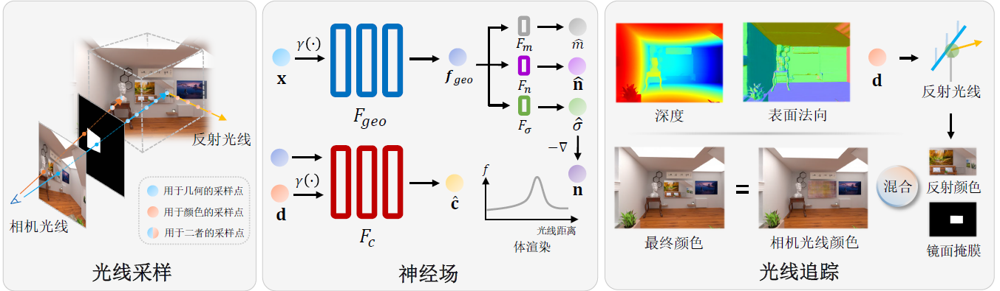
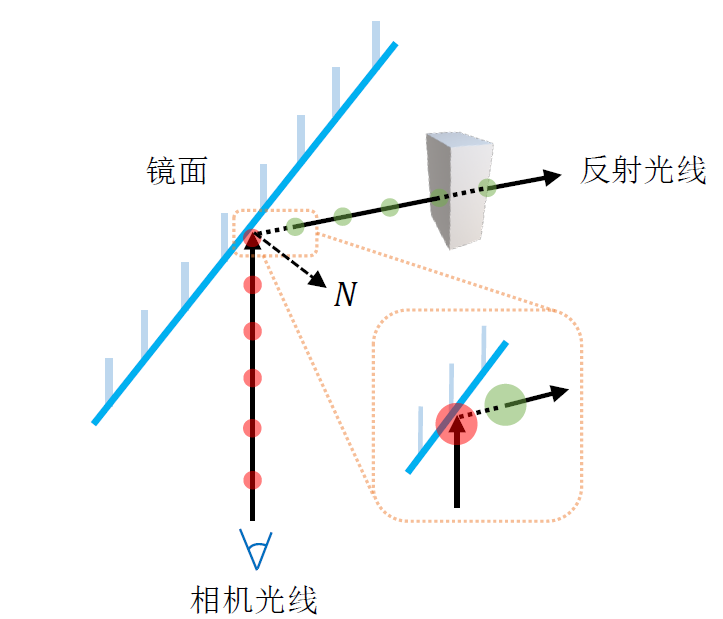
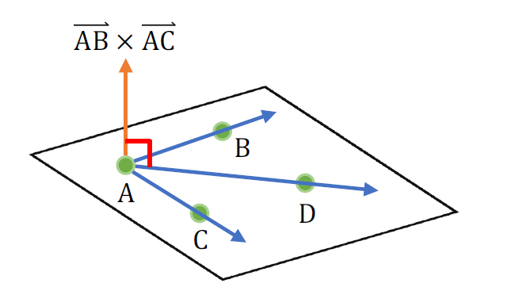
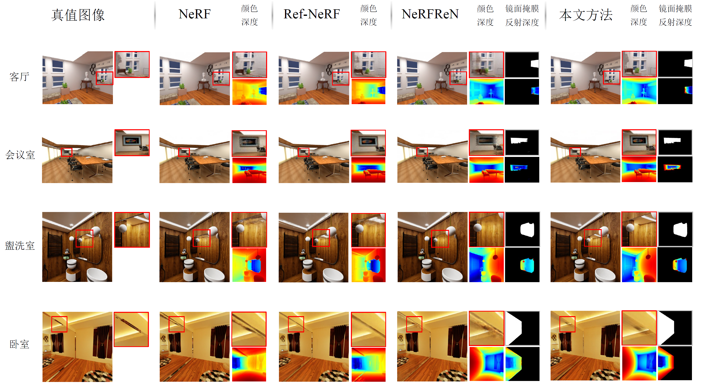
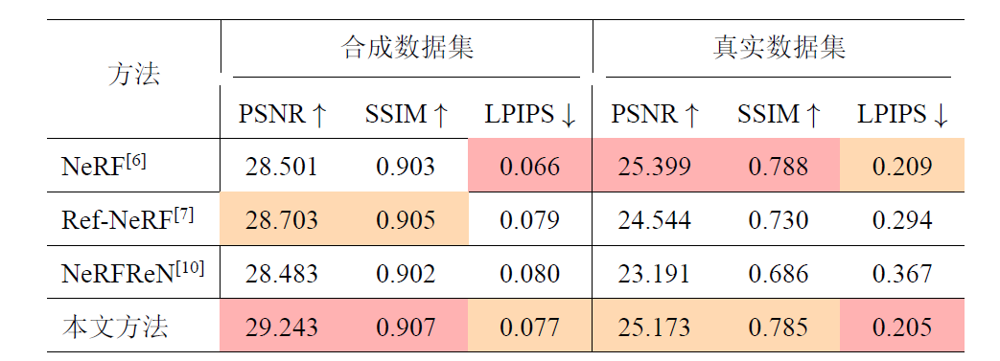

# Mirror NeRF

## 方法

### 结构

首先使用 MLP 根据位置 $x$ 的位置编码得到几何特征向量 $f_{geo}$：
$$
f_{geo}=\mathcal{F}_{geo}(\gamma_x(x))
$$
根据几何特征向量 $f_{geo}$ 以及方向 $d$ 的编码得到每个点的颜色：
$$
c=\mathcal{F}_c(f_{geo},\gamma_d(d))
$$
根据 $f_{geo}$ 预测空间中每一点的反射概率、法向、体密度：
$$
\begin{align}
& \hat{m}=\mathcal{F}_m(f_{geo})\\
& \hat{n}=\mathcal{F}_n(f_{geo})\\
& \hat{\sigma}=\mathcal{F}_\sigma(f_{geo})\\
\end{align}
$$
其中求法向和反射概率的方法值得一提：

1. 法向

   其实可以直接对体密度求梯度 $n=-\frac{\nabla \sigma(x)}{\Vert \nabla \sigma(x)\Vert}$ 来得到法向，但是这样做容易产生噪声（不平坦的几何）从而难以渲染光滑的平面镜，因此额外使用 MLP 预测一个法向 $\hat{n}$ 并且使用 $n$ 来引导 $\hat{n}$ 的优化。

   在计算光线打到物体表面的法向时，他套用了体渲染公式：
   $$
   \hat{N}=\sum_{i=1}^m T_i\alpha_i\hat{n}_i
   $$
   这可能是因为难以得到精确交点而做的妥协，但是这样做可能会导致同一点在不同光线下法向不一致。

2. 反射概率场

   反射概率场指示了光线在一个空间点处会被反射的概率。对于一条光线，它会被反射的概率同样遵从体渲染公式：
   $$
   \hat{M}=\sum_{i=1}^NT_i\alpha_im_i
   $$
   在输入训练图片时同时需要输入每个图像上镜面的掩膜，然后使用这些掩膜来指引反射概率的优化，使用的是交叉熵损失：
   $$
   \mathcal{L}_m=\sum_{r\in R_{cam}}-(M(r)\log \hat{M}(r)+(1-M(r))\log (1-\hat{M}(r)))
   $$
   

### 光线追踪

对于不反射的光线（$\hat{M}$ 比较小），其渲染和普通 NeRF 一样。对于反射的光线 $r$，首先计算它与表面交点位置 $\hat{X}$：
$$
\begin{align}
& \hat{X}(r)=o(r)+\hat{D}(r)d(r)\\
& \hat{D}(r)=\sum_{i=1}^NT_i\alpha_it_i
\end{align}
$$
其中 $o(r)$ 是光线原点，$d(r)$ 是光线方向，$\hat{D}(r)$ 是预期终止深度，它同样套用了体密度渲染公式，其中 $t_i$ 是采样点 $i$ 相较于光线原点的距离。

知道了位置、法向、光线方向就可以求反射光线：
$$
d(r_{ref})=d(r)-2(\hat{N}(r)\cdot d(r))\hat{N}(r)
$$

由于基于体密度的表示通常导致“雾状”几何，反射光线可能会在原点附近意外终止，因此在反射光线上采样点时，从光线原点沿光线方向往前一段距离才开始采样。

最后，根据光线 $r$ 的体渲染反射概率 $\hat{M}(r)$ 将光线 $r$ 与其反射光线 $r_{ref}$ 颜色混合起来：
$$
\hat{C_p}(r)=\hat{C}(r)(1-\hat{M}(r))+\hat{C_p}(r_{ref})\hat{M}(r)
$$
这个过程是递归的，当 $\hat{M}$ 为 0 或者打到指定的递归最大深度时，递归终止。

### 损失函数

1. 颜色损失
   $$
   \mathcal{L}_c=\sum_{r\in R_{cam}}\Vert \hat{C_p}(r)-C_I(r)\Vert_2^2
   $$

2. 法向损失（之前提到了）
   $$
   \mathcal{L}_n=\Vert -\frac{\nabla \sigma}{\Vert\nabla \sigma\Vert}-\hat{n}\Vert_2^2
   $$

3. 反射概率场损失（之前提到了）
   $$
   \mathcal{L}_m=\sum_{r\in R_{cam}}-(M(r)\log \hat{M}(r)+(1-M(r))\log (1-\hat{M}(r)))
   $$

4. 正则化约束

   镜面处体密度欠约束，镜子凹凸不平的表面将极大地影响反射质量。

   - 平面一致性约束

     
     $$
     \mathcal{L}_{pc}=\frac{1}{N_p}\sum_{i=1}^{N_p}\vert \vec{A_iB_i}\times \vec{A_iC_i} \cdot \vec{A_iD_i}\vert
     $$
     
   - 法向前向约束
   
     当表面法向旋转 180 度并指向表面内部时，反射方程仍然成立。这种歧义性将导致镜子的几何不正确。因此约束采样点的表面法向 $\hat{n}$ 与相机光线 $r$ 的方向成钝角：
     $$
     \mathcal{L}_{n_{reg}}=\max(0,\hat{n}\cdot d(r))^2
     $$
     

## 实验

直观效果：

质量指标：

## 问题

1. 对于一根光线，为什么不先求表面交点位置 $\hat{X}$ 然后根据这个位置求法向和反射概率？

   个人猜测是因为 $\hat{X}$ 的计算也有误差，直接用 $\hat{X}$ 预测也不准确。

2. 这个方法需要提前输入镜面反射的掩膜，太复杂了，有没有识别镜面反射的方法？

   有些光线不管怎么训练梯度都很大，是不是可以看作是镜面？

3. 这个方法只适用于重建表面平滑的、delta 分布的镜子，对于 glossy 的物体、或者说表面不规则的反射体重建是不好的。

   能否使用 Mip-NeRF 的方法，用高斯代替视锥输入到神经网络？