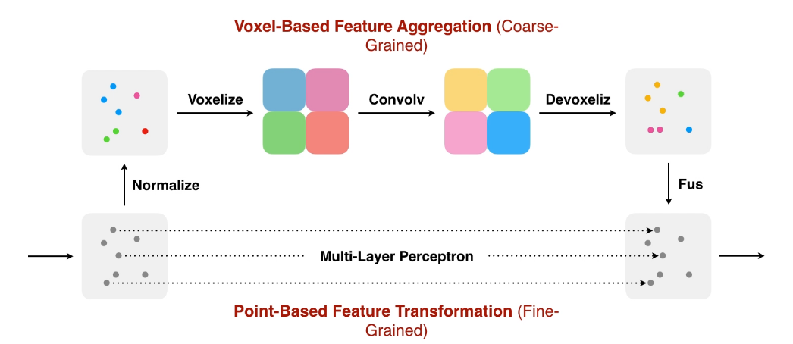

# Point-Voxel CNN for Efficient 3D Deep Learning

1. 链接：[paper](https://arxiv.org/pdf/1907.03739.pdf)

2. 背景：

   三维深度学习运用广泛，以前的做法是将点云扩充为 voxel，然后在 voxel 内标注信息。但是三维的卷积在高分辨率场景下运行非常慢。而只是用低分辨率下会丢失很多信息。

   而如果直接使用点云，那么随机访问以及卷积时根据点之间的距离调整权重会花费非常多的时间。

3. 作用：减少三维深度学习开销。

4. 贡献：提出 Point-Voxel Convolution，一种新的卷积操作。

5. 想法：

   

   有两个分支，其中一个分支直接将点云一一映射，类似于 1x1 的卷积核。另外一个分支首先将点云格点化，然后使用卷积，然后再回到点云。最后将两者结果混合即可。

6. 实验：

   

   Voxel 分支更关注大块的物体，Point 分支更关注细小的物体。